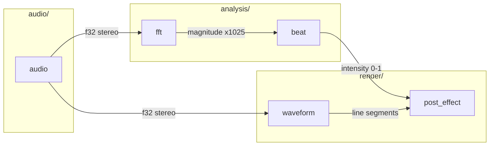

# Sync Architecture Documentation

Analyze the current codebase and update architecture documentation to match the actual implementation.

## Critical: This is a PATCH operation

- Only change content that is **factually incorrect or missing**
- Preserve existing wording if it accurately describes the code
- Do NOT rephrase sentences that are already correct
- If nothing changed in the code, the document should have **zero diff**
- Compare existing docs to code before making any edits

## Documentation Structure

- `docs/architecture.md` - System overview (landing page)
- `docs/modules/<module>.md` - One file per source module, discovered from `src/`

### Main Architecture Doc (`docs/architecture.md`)

The main document serves as a landing page with:

1. **Overview**: One paragraph describing the system
2. **System Diagram**: High-level C4-style context diagram showing major subsystems
3. **Module Index**: Table with module name, purpose (1 sentence), and link
4. **Data Flow Summary**: Simplified pipeline showing how data moves through the system
5. **Configuration Reference**: Table of key parameters with ranges and locations
6. **Thread Model**: Brief description of threading architecture

Keep this document under 200 lines. Link to module docs for details.

### Module Documents (`docs/modules/*.md`)

One file per `src/` subdirectory (audio, analysis, render, config, ui) plus main.

Each module document contains:

1. **Purpose**: What the module does (1-2 sentences, active voice)
2. **Files**: List of source files in the module
3. **Function Reference**: Table with function name and purpose
4. **Types**: Tables for public structs, enums, and constants
5. **Data Flow**: How data enters, transforms, and exits the module

## Instructions

1. **Load Standards**
   - Invoke the `technical-writing` skill before writing any documentation
   - Invoke the `architecture-diagrams` skill before creating Mermaid diagrams

2. **Analyze Current Code**
   - Read all source files in `src/`
   - Identify modules, components, and their relationships
   - Map data flow between components
   - Note key functions and their responsibilities

3. **Update Main Architecture Document**
   - Update `docs/architecture.md` as landing page
   - Keep system diagram at module level (not function level)
   - Link to module docs for implementation details
   - Reference code by file path only, no line numbers

4. **Update Module Documents**
   - Create/update `docs/modules/<module>.md` for each `src/` subdirectory plus main
   - Document public functions, structs, and constants in tables
   - Keep concise: reference tables, not prose reimplementations

5. **Update CLAUDE.md**
   - Update "Current State" to reflect reality
   - Keep it concise (CLAUDE.md is quick reference)

6. **Validation**
   - Ensure diagrams match actual code structure
   - Verify all referenced files exist
   - Check that component names match code
   - Verify all module links resolve

## Diagram Standards

### System Diagram (architecture.md)

Show modules as boxes, data flow between them. Single abstraction level.

## Source Files
@./src

## Current Architecture Doc
@./docs/architecture.md

## Module Docs Directory
@./docs/modules

## CLAUDE.md Reference
@./CLAUDE.md

## Output Format

After analysis, ensure:
- Main doc has system diagram + module index with links
- Each `src/` subdirectory has a doc in `docs/modules/`
- All cross-references resolve correctly
