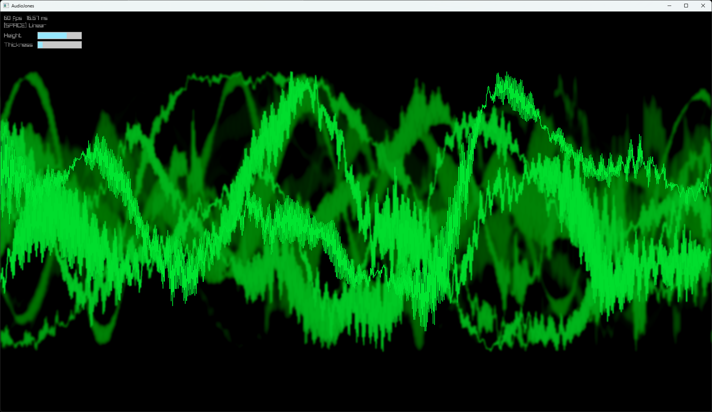

# AudioJones

Real-time audio visualizer. Captures system audio and renders reactive waveforms.



## Requirements

- Windows 10/11
- CMake 3.20+
- C++ compiler (Visual Studio 2019+ or MinGW)

## Quick Start

```bash
git clone https://github.com/yourusername/AudioJones.git
cd AudioJones

cmake -B build -S .
cmake --build build --config Release

./build/Release/AudioJones.exe
```

Play any audio on your system. The visualizer captures it automatically.

## Architecture

See [docs/arch/architecture.md](docs/arch/architecture.md) for system design.
