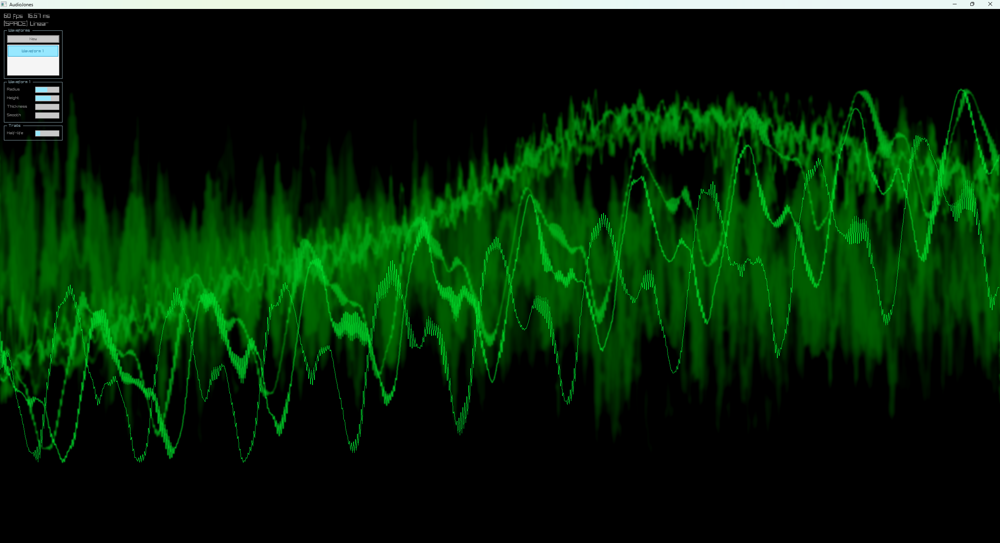
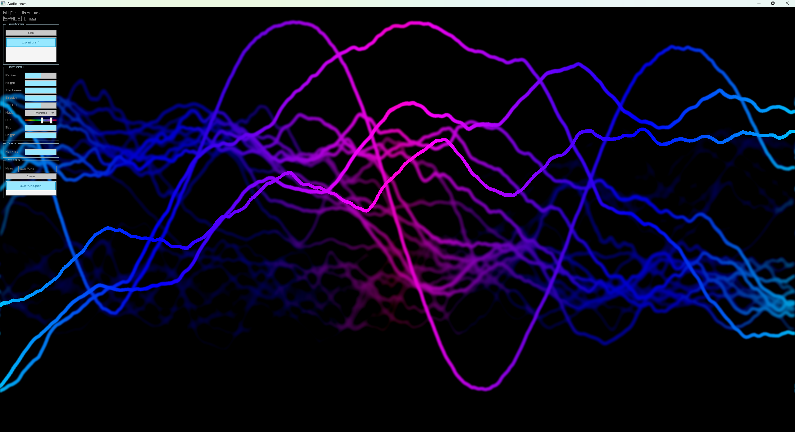
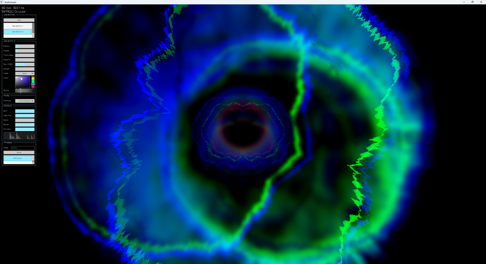

# AudioJones

Real-time audio visualizer. Captures system audio and renders reactive waveforms.








## Requirements

- Windows 10/11
- CMake 3.20+
- C++ compiler (MSYS2 UCRT64 recommended)
- Ninja (optional)

## Quick Start

```bash
git clone https://github.com/yourusername/AudioJones.git
cd AudioJones

# With Ninja
cmake -G Ninja -B build -S . -DCMAKE_BUILD_TYPE=Release

# Or default generator
cmake -B build -S . -DCMAKE_BUILD_TYPE=Release

cmake --build build
./build/AudioJones.exe
```

Play any audio on your system. The visualizer captures it automatically.

## Architecture

See [docs/architecture.md](docs/architecture.md) for system design.
