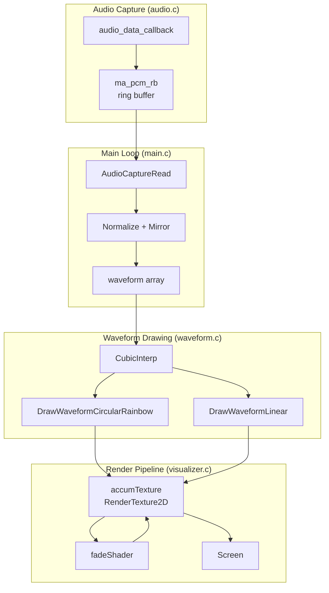

# AudioJones Architecture

> Auto-generated via `/sync-architecture`. Last sync: 2025-12-04

## Overview

Real-time circular waveform audio visualizer. Captures system audio via WASAPI loopback, renders reactive circular waveforms with rainbow colors and trail effects.

## System Diagram



## Modules

### audio.c / audio.h
Captures system audio via miniaudio WASAPI loopback.

| Function | Line | Description |
|----------|------|-------------|
| `audio_data_callback` | `audio.c:14` | Writes incoming samples to ring buffer |
| `AudioCaptureInit` | `audio.c:32` | Creates loopback device and ring buffer |
| `AudioCaptureRead` | `audio.c:125` | Reads samples from ring buffer (main thread) |

**Key constants:**
- `AUDIO_SAMPLE_RATE`: 48000 Hz
- `AUDIO_CHANNELS`: 2 (stereo)
- `AUDIO_RING_BUFFER_FRAMES`: 4096 frames

### waveform.c / waveform.h
Renders waveform samples as visual output.

| Function | Line | Description |
|----------|------|-------------|
| `CubicInterp` | `waveform.c:5` | Cubic interpolation between four points for smooth curves |
| `HsvToRgb` | `waveform.c:14` | Converts HSV (0-1 range) to raylib Color |
| `DrawWaveformLinear` | `waveform.c:42` | Oscilloscope-style horizontal waveform |
| `DrawWaveformCircularRainbow` | `waveform.c:54` | Circular waveform with 10x interpolation and rainbow hue sweep |

**Key constants:**
- `WAVEFORM_SAMPLES`: 1024
- `WAVEFORM_EXTENDED`: 2048 (palindrome for seamless loop)
- `INTERPOLATION_MULT`: 10 (smoothness factor)

### visualizer.c / visualizer.h
Manages accumulation buffer and fade shader for trail effect.

| Function | Line | Description |
|----------|------|-------------|
| `VisualizerInit` | `visualizer.c:13` | Loads fade shader, creates RenderTexture |
| `VisualizerBeginAccum` | `visualizer.c:46` | Applies fade shader to previous frame, begins new draw |
| `VisualizerEndAccum` | `visualizer.c:60` | Ends texture mode |
| `VisualizerToScreen` | `visualizer.c:65` | Blits accumulation texture to screen |

**Fade amount:** 0.95 (5% decay per frame)

### main.c
Application entry point and main loop.

| Section | Lines | Description |
|---------|-------|-------------|
| Initialization | `12-41` | Creates window, visualizer, audio capture |
| Main loop | `51-128` | Updates waveform at 30fps, renders at 60fps |
| Cleanup | `130-134` | Stops audio, frees resources |

## Data Flow

1. **Audio Callback** (`audio.c:14`): miniaudio WASAPI loopback triggers callback with system audio samples
2. **Ring Buffer Write** (`audio.c:26`): Callback writes to `ma_pcm_rb` (lock-free, thread-safe)
3. **Ring Buffer Read** (`main.c:64`): Main loop reads samples every 33ms (30fps)
4. **Normalize** (`main.c:79-88`): Scale samples so peak amplitude = 1.0
5. **Mirror** (`main.c:91-99`): Create palindrome buffer for seamless circular loop
6. **Interpolate** (`waveform.c:67-81`): Cubic interpolation generates 10x smooth points
7. **Draw** (`waveform.c:90-100`): Render line segments with rainbow HSV colors
8. **Fade** (`visualizer.c:51-57`): Previous frame multiplied by 0.95 via shader
9. **Composite** (`visualizer.c:54-56`): New waveform drawn on faded background
10. **Display** (`main.c:125`): Accumulated texture blitted to screen

## Shader

`shaders/fade.fs`: Fragment shader multiplies RGB by `fadeAmount` uniform (0.95).

## Thread Model

```
┌─────────────────────────────────┐
│ Audio Thread (miniaudio)        │
│ - audio_data_callback           │
│ - Writes to ring buffer         │
└──────────────┬──────────────────┘
               │ ma_pcm_rb (lock-free)
               ▼
┌─────────────────────────────────┐
│ Main Thread (raylib)            │
│ - Reads from ring buffer        │
│ - Updates waveform @ 30fps      │
│ - Renders @ 60fps               │
└─────────────────────────────────┘
```

## Configuration

| Parameter | Value | Location |
|-----------|-------|----------|
| Window size | 800x600 | `main.c:14` |
| Render FPS | 60 | `main.c:15` |
| Waveform update rate | 30fps | `main.c:48` |
| Base radius | 50px | `main.c:118` |
| Amplitude | 250px | `main.c:118` |
| Fade amount | 0.95 | `visualizer.c:20` |
| Rotation speed | 0.01 rad/update | `main.c:103` |
| Hue speed | 0.0025/update | `main.c:104` |

---

*Run `/sync-architecture` to regenerate this document from current code.*
