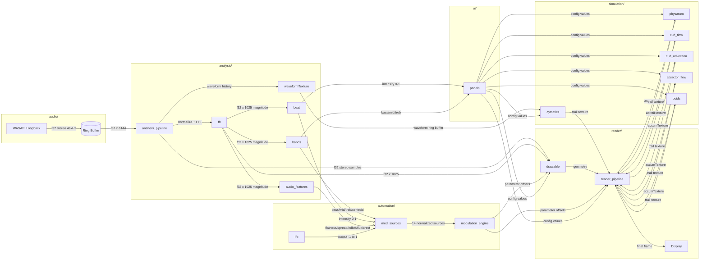

# AudioJones Architecture

> Last sync: 2026-01-21 | Commit: 106f9f0

## Overview

Modular audio visualizer with a six-stage render pipeline. WASAPI loopback feeds an analysis stage producing FFT spectrum, beat intensity, band energy, spectral features, and waveform history. These drive a modulation engine that routes audio-reactive signals and LFOs to any registered parameter. Drawables (waveforms, spectrum bars, shapes) render to an HDR accumulation buffer. Six GPU agent simulations (Physarum, Curl Flow, Curl Advection, Attractor Flow, Boids, Cymatics) read and write to this buffer. A reorderable chain of 40 shader transforms processes the output before final color correction.

## System Diagram



**Legend:** Arrows show data flow with payload type. `[(name)]` = buffer. `[name]` = module.

## Module Index

| Module | Purpose | Documentation |
|--------|---------|---------------|
| audio | Captures system audio via WASAPI loopback into a ring buffer for downstream analysis | [audio.md](modules/audio.md) |
| analysis | Transforms raw audio samples into frequency spectrum, beat detection events, band energy levels, spectral features, and waveform history for visualization and modulation | [analysis.md](modules/analysis.md) |
| automation | Routes audio-reactive and LFO signals to visual parameters via configurable modulation routes with curve shaping | [automation.md](modules/automation.md) |
| render | Draws audio-reactive visuals (waveforms, spectrum bars, shapes) and applies multi-pass post-processing effects to an accumulation buffer | [render.md](modules/render.md) |
| config | Defines configuration structures for all visual and audio parameters, with JSON serialization for preset save/load | [config.md](modules/config.md) |
| ui | Renders ImGui panels for visualization configuration, audio settings, presets, and performance monitoring with custom gradient, modulation, and analysis widgets | [ui.md](modules/ui.md) |
| simulation | GPU-accelerated agent simulations (Physarum, Curl Flow, Curl Advection, Attractor Flow, Boids, Cymatics) that deposit colored trails influenced by audio analysis | [simulation.md](modules/simulation.md) |
| main | Initializes subsystems, runs 60 FPS main loop, orchestrates audio analysis, modulation updates, and six-stage render pipeline | [main.md](modules/main.md) |

## Thread Model

```
┌─────────────────────────────────┐
│ Audio Thread (miniaudio)        │
│ - audio_data_callback           │
│ - Writes to ma_pcm_rb           │
└──────────────┬──────────────────┘
               │ lock-free ring buffer
               ▼
┌─────────────────────────────────┐
│ Main Thread (raylib)            │
│ - Drains audio @ 60fps          │
│ - FFT + beat detection @ 60fps  │
│ - Visual updates @ 20Hz         │
│ - Renders @ 60fps               │
│ - Handles UI input              │
└─────────────────────────────────┘
```

## Directory Structure

```
src/
├── main.cpp              Entry point, AppContext
├── audio/                WASAPI capture
├── analysis/             FFT, beat detection
├── automation/           LFO oscillators
├── render/               Waveform, spectrum bars, post-effects
├── simulation/           GPU agent simulations (Physarum, Curl Flow, Curl Advection, Attractor Flow, Boids, Cymatics)
├── config/               Serializable parameters
└── ui/                   Dear ImGui panels
```

---

*Run `/sync-architecture` to regenerate this document from current code.*
