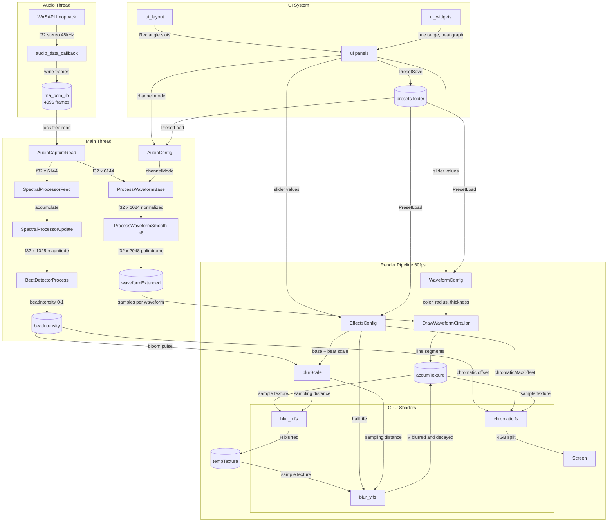

# AudioJones Architecture

> Auto-generated via `/sync-architecture`. Last sync: 2025-12-07 (SpectralProcessor extraction)

## Overview

Real-time audio visualizer that captures system audio via WASAPI loopback and renders circular or linear waveforms with physarum-inspired trail effects. Features FFT-based spectral flux beat detection driving bloom pulse and chromatic aberration effects. Supports up to 8 concurrent waveforms with per-waveform configuration, configurable stereo channel mixing modes, and preset save/load.

## System Diagram



**Legend:** Arrows show data flow with payload type. `[(name)]` = persistent buffer. `[name]` = processing step.

## Modules

### audio.cpp / audio.h

Captures system audio via miniaudio WASAPI loopback device.

| Function | Purpose |
|----------|---------|
| `audio_data_callback` | Writes incoming stereo samples to ring buffer (audio thread) |
| `AudioCaptureInit` | Creates loopback device at 48kHz, allocates 4096-frame ring buffer |
| `AudioCaptureStart` | Starts the loopback device |
| `AudioCaptureStop` | Stops the loopback device |
| `AudioCaptureUninit` | Frees device and ring buffer |
| `AudioCaptureRead` | Reads up to N frames from ring buffer (main thread, lock-free) |
| `AudioCaptureAvailable` | Returns frame count available in ring buffer |

**Constants:**
- `AUDIO_SAMPLE_RATE`: 48000 Hz
- `AUDIO_CHANNELS`: 2 (stereo)
- `AUDIO_BUFFER_FRAMES`: 1024 frames per read
- `AUDIO_RING_BUFFER_FRAMES`: 4096 frames capacity
- `AUDIO_MAX_FRAMES_PER_UPDATE`: 3072 frames (~64ms at 48kHz, covers 50ms update + margin)

### spectral.cpp / spectral.h

Computes FFT magnitude spectrum from audio samples. Provides shared spectral data for beat detection and future spectrum visualization.

| Function | Purpose |
|----------|---------|
| `SpectralProcessorInit` | Allocates FFT config (kiss_fftr), initializes Hann window |
| `SpectralProcessorUninit` | Frees FFT config and processor |
| `SpectralProcessorFeed` | Accumulates stereo samples as mono into internal buffer |
| `SpectralProcessorUpdate` | Runs 2048-point FFT with 75% overlap when buffer full, returns true if spectrum updated |
| `SpectralProcessorGetMagnitude` | Returns pointer to 1025-bin magnitude spectrum |
| `SpectralProcessorGetBinCount` | Returns bin count (1025) |
| `SpectralProcessorGetBinFrequency` | Converts bin index to frequency in Hz |

**SpectralProcessor struct fields (opaque):**
- `fftConfig`: kiss_fftr configuration for real-to-complex FFT
- `sampleBuffer[2048]`: Accumulated mono samples for FFT input
- `sampleCount`: Current samples in buffer
- `windowedSamples[2048]`: Hann-windowed input
- `spectrum[1025]`: Complex FFT output bins
- `magnitude[1025]`: Computed magnitude spectrum

**Constants:**
- `SPECTRAL_FFT_SIZE`: 2048 samples (43ms window at 48kHz)
- `SPECTRAL_BIN_COUNT`: 1025 bins (FFT_SIZE/2 + 1)

### beat.cpp / beat.h

Detects beats using spectral flux analysis in the bass frequency range (20-200Hz). Consumes magnitude spectrum from SpectralProcessor.

| Function | Purpose |
|----------|---------|
| `BeatDetectorInit` | Clears history buffers and state |
| `BeatDetectorProcess` | Computes spectral flux in kick bins (1-8), detects beats when flux exceeds mean + N×stddev |
| `BeatDetectorGetBeat` | Returns true if beat detected this frame |
| `BeatDetectorGetIntensity` | Returns current beat intensity (0.0-1.0, exponential decay after beat) |

**BeatDetector struct fields:**
- `magnitude[1025]`, `prevMagnitude[1025]`: Current and previous magnitude spectra (copied from SpectralProcessor)
- `fluxHistory[43]`: Rolling window of spectral flux values
- `historyIndex`: Circular buffer write position
- `fluxAverage`, `fluxStdDev`: Statistics for threshold calculation
- `bassHistory[43]`, `bassAverage`: Bass energy tracking
- `beatDetected`: True if beat detected this frame
- `beatIntensity`: 0.0-1.0 intensity, decays exponentially after beat
- `timeSinceLastBeat`: Debounce timer
- `graphHistory[64]`: Intensity history for UI visualization
- `graphIndex`: Circular buffer write position for graph

**Constants:**
- `BEAT_SPECTRUM_SIZE`: 1025 bins (matches SPECTRAL_BIN_COUNT)
- `BEAT_HISTORY_SIZE`: 43 frames (~860ms at 20Hz)
- `BEAT_GRAPH_SIZE`: 64 samples for display
- `BEAT_DEBOUNCE_SEC`: 0.15s minimum between beats
- `INTENSITY_DECAY_RATE`: 0.001 (fraction remaining after 1 second)

### audio_config.h

Holds audio processing configuration for preset serialization.

**AudioConfig fields:**
- `channelMode`: Stereo channel mixing mode (ChannelMode enum), default CHANNEL_LEFT

### effects_config.h

Consolidates effect parameters into a single struct for UI and preset serialization.

**EffectsConfig fields:**
- `halfLife`: Trail persistence in seconds (0.1-2.0), default 0.5
- `baseBlurScale`: Base blur sampling distance in pixels (0-4), default 1
- `beatBlurScale`: Additional blur on beats in pixels (0-5), default 2
- `beatSensitivity`: Beat detection threshold in standard deviations above mean flux (1.0-3.0), default 1.5
- `chromaticMaxOffset`: Maximum RGB channel offset on beats in pixels (0-20), default 12

### waveform.cpp / waveform.h

Transforms raw audio samples into display-ready waveform data and renders as circular or linear visualizations.

| Function | Purpose |
|----------|---------|
| `ProcessWaveformBase` | Mixes stereo to mono per ChannelMode, zero-pads if short, normalizes to peak=1.0 |
| `ProcessWaveformSmooth` | Creates palindrome, applies O(N) sliding window smoothing |
| `SmoothWaveform` | Static helper: sliding window moving average |
| `MixStereoToMono` | Static helper: mixes interleaved stereo to mono per ChannelMode |
| `GetSegmentColor` | Static helper: computes per-segment color for rainbow mode |
| `CubicInterp` | Static helper: cubic interpolation between 4 points |
| `DrawWaveformLinear` | Renders horizontal oscilloscope-style waveform |
| `DrawWaveformCircular` | Renders circular waveform with cubic interpolation |

**ChannelMode enum:**
- `CHANNEL_LEFT`: Left channel only
- `CHANNEL_RIGHT`: Right channel only
- `CHANNEL_MAX`: Max magnitude of L/R with sign from larger
- `CHANNEL_MIX`: (L+R)/2 mono downmix
- `CHANNEL_SIDE`: L-R stereo difference
- `CHANNEL_INTERLEAVED`: Alternating L/R samples (legacy behavior)

**WaveformConfig fields:**
- `amplitudeScale`: Height relative to min(width, height), range 0.05-0.5, default 0.35
- `thickness`: Line width in pixels, range 1-25, default 2
- `smoothness`: Smoothing window radius, range 0-50, default 5
- `radius`: Base radius fraction, range 0.05-0.45, default 0.25
- `rotationSpeed`: Radians per update, range -0.05 to 0.05, default 0.0
- `rotationOffset`: Base rotation offset in radians (for staggered starts)
- `color`: RGBA color, default WHITE
- `colorMode`: COLOR_MODE_SOLID or COLOR_MODE_RAINBOW, default solid
- `rainbowHue`: Starting hue offset (0-360), default 0
- `rainbowRange`: Hue degrees to span (0-360), default 360
- `rainbowSat`: Saturation (0-1), default 1
- `rainbowVal`: Value/brightness (0-1), default 1

**Constants:**
- `WAVEFORM_SAMPLES`: 1024
- `WAVEFORM_EXTENDED`: 2048 (palindrome for seamless loop)
- `INTERPOLATION_MULT`: 10 (points per sample for smooth curves)
- `MAX_WAVEFORMS`: 8

### visualizer.cpp / visualizer.h

Manages accumulation buffer, two-pass separable blur for physarum-style trail diffusion, and beat-reactive chromatic aberration.

| Function | Purpose |
|----------|---------|
| `VisualizerInit` | Loads blur and chromatic shaders, creates ping-pong RenderTextures |
| `VisualizerUninit` | Frees shaders and render textures |
| `VisualizerResize` | Recreates render textures at new dimensions |
| `VisualizerBeginAccum` | Computes blur scale from beat intensity, runs horizontal blur, then vertical blur + decay |
| `VisualizerEndAccum` | Ends texture mode |
| `VisualizerToScreen` | Applies chromatic aberration if enabled, blits accumulation texture to screen |

**Visualizer struct fields:**
- `accumTexture`: Main accumulation buffer
- `tempTexture`: Intermediate buffer for separable blur
- `blurHShader`, `blurVShader`: Separable Gaussian blur shaders
- `chromaticShader`: Radial chromatic aberration shader
- `blurHResolutionLoc`, `blurVResolutionLoc`: Shader uniform locations for resolution
- `blurHScaleLoc`, `blurVScaleLoc`: Shader uniform locations for blur sampling distance
- `halfLifeLoc`, `deltaTimeLoc`: Shader uniform locations for decay parameters
- `chromaticResolutionLoc`, `chromaticOffsetLoc`: Shader uniform locations for chromatic aberration
- `currentBeatIntensity`: Stored beat intensity for chromatic effect
- `effects`: EffectsConfig containing halfLife, blur scales, beat sensitivity, and chromatic offset
- `screenWidth`, `screenHeight`: Current render dimensions

### ui_layout.cpp / ui_layout.h

Declarative layout system that eliminates manual coordinate math for raygui panels.

| Function | Purpose |
|----------|---------|
| `UILayoutBegin` | Creates layout context at (x,y) with width, padding, spacing |
| `UILayoutRow` | Advances to next row with specified height |
| `UILayoutSlot` | Returns Rectangle consuming widthRatio of row (1.0 = remaining) |
| `UILayoutEnd` | Returns final Y position after all rows |
| `UILayoutGroupBegin` | Starts labeled group box (deferred draw) |
| `UILayoutGroupEnd` | Draws group box around contained rows |

**UILayout fields:**
- `x`, `y`: Container origin
- `width`, `padding`, `spacing`: Dimensions
- `rowHeight`, `slotX`: Current row state
- `groupStartY`, `groupTitle`: Deferred group box state

### ui_widgets.cpp / ui_widgets.h

Custom raygui-style widgets extending base functionality.

| Function | Purpose |
|----------|---------|
| `GuiHueRangeSlider` | Dual-handle slider with rainbow gradient for hue range selection (0-360) |
| `GuiBeatGraph` | Scrolling bar graph displaying beat intensity history (64 samples) |

### ui.cpp / ui.h

Waveform settings and effects panel using ui_layout and ui_widgets.

| Function | Purpose |
|----------|---------|
| `UIStateInit` | Allocates UIState |
| `UIStateUninit` | Frees UIState |
| `UIDrawWaveformPanel` | Renders waveform list, per-waveform settings, audio channel mode, effects controls (blur, half-life, beat sensitivity, bloom, chromatic), beat graph |

**UIState fields (opaque struct):**
- `waveformScrollIndex`: Waveform list scroll state
- `colorModeDropdownOpen`: Dropdown z-order state
- `channelModeDropdownOpen`: Channel mode dropdown z-order state
- `hueRangeDragging`: Hue slider drag state (0=none, 1=left, 2=right)

**Layout constants:**
- Panel width: 180px
- Group spacing: 8px
- Row height: 20px
- Color picker: 62×62px

### ui_preset.cpp / ui_preset.h

Preset management panel for save/load operations.

| Function | Purpose |
|----------|---------|
| `PresetPanelInit` | Allocates PresetPanelState, loads preset file list from `presets/` directory |
| `PresetPanelUninit` | Frees PresetPanelState |
| `UIDrawPresetPanel` | Renders preset name input, Save button, preset list with auto-load on selection |

**PresetPanelState fields (opaque struct):**
- `presetFiles[32]`: Cached preset filenames
- `presetFileCount`: Number of presets found
- `selectedPreset`, `presetScrollIndex`: Preset list state
- `prevSelectedPreset`: Tracks selection changes for auto-load
- `presetName[64]`, `presetNameEditMode`: Text input state

### preset.cpp / preset.h

Serializes visualizer configurations as JSON files using nlohmann/json.

| Function | Purpose |
|----------|---------|
| `PresetDefault` | Returns default Preset with one waveform |
| `PresetSave` | Writes Preset to JSON file, returns false on failure |
| `PresetLoad` | Reads Preset from JSON file, returns false on failure |
| `PresetListFiles` | Enumerates `presets/` directory, returns up to 32 filenames |

**Preset struct fields:**
- `name[64]`: Display name
- `effects`: EffectsConfig (halfLife, blur scales, beat sensitivity, chromatic offset)
- `audio`: AudioConfig (channel mode)
- `waveforms[8]`: WaveformConfig array
- `waveformCount`: Active waveform count (1-8)

**Implementation notes:**
- C++ with `extern "C"` wrapper for C compatibility
- Uses `<filesystem>` for directory enumeration
- Creates `presets/` directory if missing

### main.cpp

Application entry point. Consolidates runtime state in `AppContext` and coordinates module lifecycle.

| Function | Purpose |
|----------|---------|
| `AppContextInit` | Allocates context, initializes Visualizer/AudioCapture/UIState/PresetPanelState/SpectralProcessor/BeatDetector in order |
| `AppContextUninit` | Frees resources in reverse order, NULL-safe |
| `UpdateWaveformAudio` | Reads audio, feeds SpectralProcessor, calls BeatDetectorProcess when FFT updates, calls ProcessWaveformBase and ProcessWaveformSmooth per waveform, increments globalTick |
| `RenderWaveforms` | Dispatches to DrawWaveformLinear or DrawWaveformCircular based on mode |
| `main` | Creates window, runs 60fps loop with 20fps waveform updates, passes beat intensity to visualizer |

**AppContext struct fields:**
- `vis`: Visualizer instance
- `capture`: AudioCapture instance
- `ui`: UIState instance
- `presetPanel`: PresetPanelState instance
- `spectral`: SpectralProcessor instance
- `beat`: BeatDetector instance
- `audio`: AudioConfig instance (channel mode)
- `audioBuffer[6144]`: Raw samples from ring buffer (3072 frames × 2 channels)
- `waveform[1024]`: Base normalized waveform
- `waveformExtended[8][2048]`: Per-waveform smoothed palindromes
- `waveforms[8]`: Per-waveform configuration
- `waveformCount`, `selectedWaveform`: Active waveform tracking
- `mode`: WAVEFORM_LINEAR or WAVEFORM_CIRCULAR
- `waveformAccumulator`: Fixed-timestep accumulator for 20fps updates
- `globalTick`: Shared counter for synchronized rotation across waveforms

## Data Flow

1. **Audio Callback** (`audio.cpp`): miniaudio triggers callback with system audio at 48kHz stereo
2. **Ring Buffer Write** (`audio.cpp`): Callback writes to `ma_pcm_rb` (lock-free)
3. **Ring Buffer Read** (`main.cpp`): Main loop drains up to 3072 frames every 50ms (20fps)
4. **Spectral Processing** (`spectral.cpp`): Accumulates mono samples, runs 2048-point FFT with Hann window and 75% overlap, outputs 1025-bin magnitude spectrum
5. **Beat Detection** (`beat.cpp`): Computes spectral flux in bass bins (20-200Hz) from magnitude spectrum, detects beats when flux exceeds mean + sensitivity×stddev
6. **Base Processing** (`waveform.cpp`): Mixes stereo to mono per ChannelMode, normalizes samples to peak=1.0, zero-pads if fewer frames
7. **Per-Waveform Processing** (`waveform.cpp`): Creates palindrome, applies smoothing window
8. **Rotation Calculation** (`waveform.cpp`): Computes effective rotation as `rotationOffset + rotationSpeed * globalTick`
9. **Interpolation** (`waveform.cpp`): Cubic interpolation for smooth curves during render
10. **Draw** (`waveform.cpp`): Renders line segments with per-waveform color
11. **Blur Scale** (`visualizer.cpp`): Computes `baseBlurScale + beatIntensity * beatBlurScale` for bloom pulse
12. **Blur Pass 1** (`visualizer.cpp`): Horizontal 5-tap Gaussian blur (scale determines sampling distance)
13. **Blur Pass 2 + Decay** (`visualizer.cpp`): Vertical blur + exponential decay based on halfLife
14. **Composite** (`visualizer.cpp`): New waveform drawn on blurred background
15. **Chromatic Aberration** (`visualizer.cpp`): Beat-reactive radial RGB split if chromaticMaxOffset > 0
16. **Display** (`main.cpp`): Accumulated texture blitted to screen
17. **UI Overlay** (`ui.cpp`, `ui_preset.cpp`): Panels modify WaveformConfig array, EffectsConfig, and AudioConfig

## Shaders

Separable Gaussian blur with physarum-style diffusion, plus beat-reactive post-processing:

| Shader | Purpose |
|--------|---------|
| `shaders/blur_h.fs` | Horizontal 5-tap Gaussian `[1,4,6,4,1]/16` with configurable sampling distance |
| `shaders/blur_v.fs` | Vertical 5-tap Gaussian + framerate-independent exponential decay with configurable sampling distance |
| `shaders/chromatic.fs` | Radial chromatic aberration: splits RGB channels outward from screen center proportional to distance and beat intensity |

**Decay formula (blur_v.fs):**
```glsl
float decayMultiplier = exp(-0.693147 * deltaTime / halfLife);
```
Includes 0.008 floor subtraction to overcome 8-bit quantization artifacts.

**Ping-pong pipeline:**
```
accumTexture --[blur_h]--> tempTexture --[blur_v + decay]--> accumTexture
```

## Thread Model

```
┌─────────────────────────────────┐
│ Audio Thread (miniaudio)        │
│ - audio_data_callback           │
│ - Writes to ring buffer         │
└──────────────┬──────────────────┘
               │ ma_pcm_rb (lock-free)
               ▼
┌─────────────────────────────────┐
│ Main Thread (raylib)            │
│ - Reads from ring buffer        │
│ - Updates waveform @ 20fps      │
│ - Renders @ 60fps               │
│ - Handles UI input              │
└─────────────────────────────────┘
```

## Configuration

| Parameter | Value | Location |
|-----------|-------|----------|
| Window size | 1920×1080 (resizable) | `main.cpp` |
| Render FPS | 60 | `main.cpp` |
| Waveform update rate | 20fps (50ms interval) | `main.cpp` |
| Max waveforms | 8 | `waveform.h` |
| Trail half-life | 0.1-2.0s (UI slider) | `effects_config.h` |
| Base blur scale | 0-4 pixels (UI slider) | `effects_config.h` |
| Beat blur scale | 0-5 pixels (UI slider) | `effects_config.h` |
| Beat sensitivity | 1.0-3.0 (UI slider) | `effects_config.h` |
| Chromatic max offset | 0-20 pixels (UI slider) | `effects_config.h` |
| Beat debounce | 150ms minimum | `beat.h` |
| Beat history | 43 frames (~860ms rolling average) | `beat.h` |
| Blur kernel | 5-tap Gaussian [1,4,6,4,1]/16 | `blur_h.fs`, `blur_v.fs` |
| Rotation speed range | -0.05 to 0.05 rad/update | `ui.cpp` |
| Preset directory | `presets/` | `preset.cpp` |
| Max preset files | 32 | `preset.h` |
| UI panel width | 180px | `ui.cpp` |

---

*Run `/sync-architecture` to regenerate this document from current code.*
