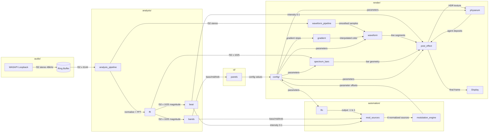

# AudioJones Architecture

> Last sync: 2025-12-28 | Commit: 3b0c93c

## Overview

Real-time audio visualizer that captures system audio via WASAPI loopback and renders circular or linear waveforms with GPU compute shader physarum simulation and fractal feedback (recursive zoom/rotation). Features 2048-point FFT spectral flux beat detection driving bloom pulse and chromatic aberration. Supports kaleidoscope mirroring and animated voronoi cell overlay. Allows up to 8 concurrent waveforms with per-waveform configuration, stereo channel mixing modes, 32-band spectrum bars, 3-band energy meters, and JSON preset save/load.

## System Diagram



**Legend:** Arrows show data flow with payload type. `[(name)]` = buffer. `[name]` = module.

## Module Index

| Module | Purpose | Documentation |
|--------|---------|---------------|
| audio | Captures system audio via WASAPI loopback into lock-free ring buffer for real-time processing | [audio.md](modules/audio.md) |
| analysis | Converts stereo audio samples into frequency-domain data, extracts beat events, and computes smoothed bass/mid/treble energy levels | [analysis.md](modules/analysis.md) |
| automation | Routes modulation sources (audio bands, beat detection, LFOs) to effect parameters through configurable curves | [automation.md](modules/automation.md) |
| render | Converts audio waveforms and spectrum data into GPU-rendered visuals through shader-based feedback accumulation | [render.md](modules/render.md) |
| config | Centralizes runtime parameters as POD structs with JSON serialization for preset save/load | [config.md](modules/config.md) |
| ui | Renders ImGui panels with modulation-aware controls and custom themed widgets | [ui.md](modules/ui.md) |
| main | Orchestrates application lifecycle, routing audio through analysis/modulation/rendering pipelines at 60fps with 20Hz visual throttling | [main.md](modules/main.md) |

## Thread Model

```
┌─────────────────────────────────┐
│ Audio Thread (miniaudio)        │
│ - audio_data_callback           │
│ - Writes to ma_pcm_rb           │
└──────────────┬──────────────────┘
               │ lock-free ring buffer
               ▼
┌─────────────────────────────────┐
│ Main Thread (raylib)            │
│ - Drains audio @ 60fps          │
│ - FFT + beat detection @ 60fps  │
│ - Visual updates @ 20Hz         │
│ - Renders @ 60fps               │
│ - Handles UI input              │
└─────────────────────────────────┘
```

## Directory Structure

```
src/
├── main.cpp              Entry point, AppContext
├── audio/                WASAPI capture
├── analysis/             FFT, beat detection
├── automation/           LFO oscillators
├── render/               Waveform, spectrum bars, post-effects
├── config/               Serializable parameters
└── ui/                   Dear ImGui panels
```

---

*Run `/sync-architecture` to regenerate this document from current code.*
