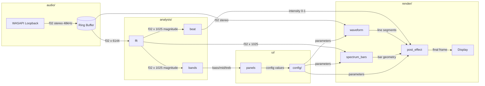

# AudioJones Architecture

> Last sync: 2025-12-09 (Phase 6 - Directory reorganization complete)

## Overview

Real-time audio visualizer that captures system audio via WASAPI loopback and renders circular or linear waveforms with physarum-inspired trail effects. Features 2048-point FFT spectral flux beat detection driving bloom pulse and chromatic aberration. Supports up to 8 concurrent waveforms with per-waveform configuration, stereo channel mixing modes, 32-band spectrum bars, 3-band energy meters, and JSON preset save/load.

## System Diagram



**Legend:** Arrows show data flow with payload type. `[(name)]` = buffer. `[name]` = module.

## Module Index

| Module | Purpose | Documentation |
|--------|---------|---------------|
| audio | Captures system audio via WASAPI loopback into ring buffer | [audio.md](modules/audio.md) |
| analysis | FFT magnitude spectrum, beat detection, and band energy extraction | [analysis.md](modules/analysis.md) |
| render | Waveform/spectrum visualization with GPU post-effects | [render.md](modules/render.md) |
| config | Serializable parameters and JSON preset I/O | [config.md](modules/config.md) |
| ui | Real-time parameter editing via raygui panels | [ui.md](modules/ui.md) |
| main | Application entry point and AppContext orchestration | [main.md](modules/main.md) |

## Data Flow Summary

1. **Capture**: Audio thread writes 48kHz stereo to ring buffer (lock-free)
2. **Read**: Main thread drains up to 3072 frames every 50ms (20Hz update)
3. **Analyze**: FFT computes 1025-bin magnitude spectrum; beat detector tracks spectral flux; band energies extract bass/mid/treb RMS
4. **Transform**: Waveform processor normalizes audio, creates smoothed palindrome per layer
5. **Render**: Post-effect accumulates waveforms with blur decay; applies beat-reactive bloom and chromatic aberration

## Thread Model

```
┌─────────────────────────────────┐
│ Audio Thread (miniaudio)        │
│ - audio_data_callback           │
│ - Writes to ma_pcm_rb           │
└──────────────┬──────────────────┘
               │ lock-free ring buffer
               ▼
┌─────────────────────────────────┐
│ Main Thread (raylib)            │
│ - Reads audio @ 20Hz            │
│ - FFT + beat detection          │
│ - Renders @ 60fps               │
│ - Handles UI input              │
└─────────────────────────────────┘
```

## Configuration Reference

| Parameter | Range | Default | Location |
|-----------|-------|---------|----------|
| Trail half-life | 0.1-2.0s | 0.5s | `config/effect_config.h` |
| Base blur scale | 0-4px | 1px | `config/effect_config.h` |
| Beat blur scale | 0-5px | 2px | `config/effect_config.h` |
| Beat sensitivity | 1.0-3.0 | 1.5 | `config/effect_config.h` |
| Chromatic offset | 0-20px | 12px | `config/effect_config.h` |
| Max waveforms | - | 8 | `render/waveform.h` |
| Waveform samples | - | 1024 | `render/waveform.h` |
| FFT size | - | 2048 | `analysis/fft.h` |
| Spectrum bands | - | 32 | `config/spectrum_bars_config.h` |
| Beat debounce | - | 150ms | `analysis/beat.h` |
| Audio sample rate | - | 48kHz | `audio/audio.h` |
| Ring buffer size | - | 4096 frames | `audio/audio.h` |

## Directory Structure

```
src/
├── main.cpp              Entry point, AppContext
├── audio/                WASAPI capture
├── analysis/             FFT, beat detection
├── render/               Waveform, spectrum bars, post-effects
├── config/               Serializable parameters
└── ui/                   raygui panels
```

---

*Run `/sync-architecture` to regenerate this document from current code.*
