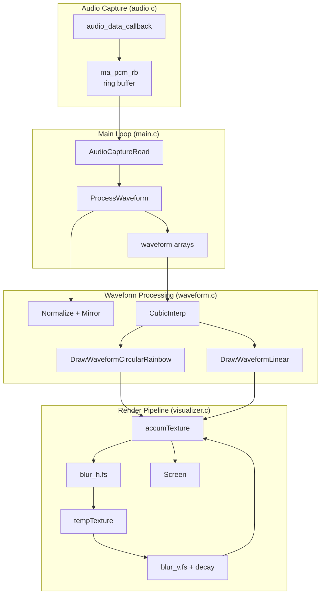

# AudioJones Architecture

> Auto-generated via `/sync-architecture`. Last sync: 2025-12-04

## Overview

Real-time circular waveform audio visualizer. Captures system audio via WASAPI loopback, renders reactive circular waveforms with rainbow colors and physarum-inspired trail effects using separable Gaussian blur.

## System Diagram



## Modules

### audio.c / audio.h
Captures system audio via miniaudio WASAPI loopback.

| Function | Description |
|----------|-------------|
| `audio_data_callback` | Writes incoming samples to ring buffer |
| `AudioCaptureInit` | Creates loopback device and ring buffer |
| `AudioCaptureRead` | Reads samples from ring buffer (main thread) |

**Key constants:**
- `AUDIO_SAMPLE_RATE`: 48000 Hz
- `AUDIO_CHANNELS`: 2 (stereo)
- `AUDIO_RING_BUFFER_FRAMES`: 4096 frames

### waveform.c / waveform.h
Processes raw audio into display-ready waveforms and renders them.

| Function | Description |
|----------|-------------|
| `ProcessWaveform` | Normalizes samples to peak=1.0, creates palindrome mirror for seamless circular display |
| `CubicInterp` | Cubic interpolation between four points for smooth curves |
| `DrawWaveformLinear` | Oscilloscope-style horizontal waveform |
| `DrawWaveformCircularRainbow` | Circular waveform with 10x interpolation and rainbow hue sweep |

**Key constants:**
- `WAVEFORM_SAMPLES`: 1024
- `WAVEFORM_EXTENDED`: 2048 (palindrome for seamless loop)
- `INTERPOLATION_MULT`: 10 (smoothness factor)

### visualizer.c / visualizer.h
Manages accumulation buffer and separable blur shaders for physarum-style trail diffusion.

| Function | Description |
|----------|-------------|
| `VisualizerInit` | Loads blur shaders, creates ping-pong RenderTextures |
| `VisualizerBeginAccum` | Two-pass blur: horizontal then vertical + decay |
| `VisualizerEndAccum` | Ends texture mode |
| `VisualizerToScreen` | Blits accumulation texture to screen |

**Trail settings:** halfLife configurable via UI (exponential decay)

### main.c
Application entry point and main loop.

| Section | Description |
|---------|-------------|
| Initialization | Creates window, visualizer, audio capture |
| Main loop | Updates waveform at 20fps, renders at 60fps |
| Cleanup | Stops audio, frees resources |

## Data Flow

1. **Audio Callback** (`audio.c`): miniaudio WASAPI loopback triggers callback with system audio samples
2. **Ring Buffer Write** (`audio.c`): Callback writes to `ma_pcm_rb` (lock-free, thread-safe)
3. **Ring Buffer Read** (`main.c`): Main loop reads samples every 50ms (20fps)
4. **Process Waveform** (`waveform.c`): Normalize samples (peak=1.0), create palindrome mirror, smooth joins
5. **Interpolate** (`waveform.c`): Cubic interpolation generates 10x smooth points
6. **Draw** (`waveform.c`): Render line segments with rainbow HSV colors
7. **Blur Pass 1** (`visualizer.c`): Horizontal 5-tap Gaussian blur via shader
8. **Blur Pass 2 + Decay** (`visualizer.c`): Vertical blur + exponential decay
9. **Composite** (`visualizer.c`): New waveform drawn on blurred background
10. **Display** (`main.c`): Accumulated texture blitted to screen

## Shaders

Separable Gaussian blur with physarum-style diffusion:

| Shader | Purpose |
|--------|---------|
| `shaders/blur_h.fs` | Horizontal 5-tap Gaussian `[1,4,6,4,1]/16` |
| `shaders/blur_v.fs` | Vertical 5-tap Gaussian + exponential decay |

**Ping-pong pipeline:**
```
accumTexture --[blur_h]--> tempTexture --[blur_v + decay]--> accumTexture
```

## Thread Model

```
┌─────────────────────────────────┐
│ Audio Thread (miniaudio)        │
│ - audio_data_callback           │
│ - Writes to ring buffer         │
└──────────────┬──────────────────┘
               │ ma_pcm_rb (lock-free)
               ▼
┌─────────────────────────────────┐
│ Main Thread (raylib)            │
│ - Reads from ring buffer        │
│ - Updates waveform @ 30fps      │
│ - Renders @ 60fps               │
└─────────────────────────────────┘
```

## Configuration

| Parameter | Value | Location |
|-----------|-------|----------|
| Window size | 1920x1080 | `main.c` |
| Render FPS | 60 | `main.c` |
| Waveform update rate | 20fps | `main.c` |
| Base radius | 25% of min dimension | `main.c` |
| Trail half-life | 0.1-2.0s (UI slider) | `visualizer.c` |
| Blur kernel | 5-tap Gaussian | `blur_h.fs`, `blur_v.fs` |
| Rotation speed | 0.01 rad/update | `main.c` |
| Hue speed | 0.0025/update | `main.c` |

---

*Run `/sync-architecture` to regenerate this document from current code.*
