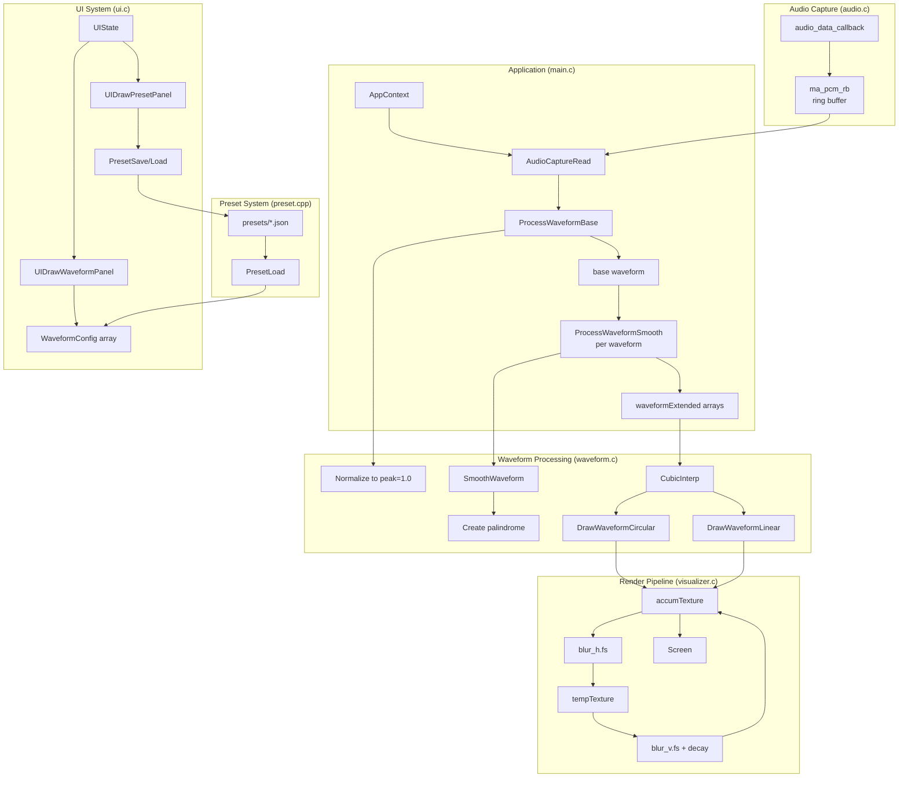

# AudioJones Architecture

> Auto-generated via `/sync-architecture`. Last sync: 2025-12-06

## Overview

Real-time circular waveform audio visualizer. Captures system audio via WASAPI loopback, renders up to 8 concurrent waveforms with configurable colors and physarum-inspired trail effects using separable Gaussian blur.

## System Diagram



## Modules

### audio.c / audio.h
Captures system audio via miniaudio WASAPI loopback.

| Function | Description |
|----------|-------------|
| `audio_data_callback` | Writes incoming samples to ring buffer |
| `AudioCaptureInit` | Creates loopback device and ring buffer |
| `AudioCaptureRead` | Reads samples from ring buffer (main thread) |

**Key constants:**
- `AUDIO_SAMPLE_RATE`: 48000 Hz
- `AUDIO_CHANNELS`: 2 (stereo)
- `AUDIO_RING_BUFFER_FRAMES`: 4096 frames

### waveform.c / waveform.h
Transforms raw audio into display-ready waveforms and renders them as circular or linear visualizations.

| Function | Description |
|----------|-------------|
| `WaveformConfigDefault` | Returns default WaveformConfig (radius=0.25, thickness=2, smoothness=5) |
| `ProcessWaveformBase` | Normalizes samples to peak=1.0, zero-pads if fewer than WAVEFORM_SAMPLES |
| `ProcessWaveformSmooth` | Applies sliding-window smoothing, creates palindrome for seamless circular display |
| `SmoothWaveform` | O(N) sliding window moving average (static helper) |
| `CubicInterp` | Cubic interpolation between four points for smooth curves (static helper) |
| `DrawWaveformLinear` | Oscilloscope-style horizontal waveform with configurable thickness |
| `DrawWaveformCircular` | Circular waveform with cubic interpolation and configurable color |

**WaveformConfig parameters:**
- `amplitudeScale`: Height relative to min(width, height), default 0.35
- `thickness`: Line width in pixels, range 1-10
- `smoothness`: Smoothing window radius (0=none, higher=smoother)
- `radius`: Base radius as fraction of min(width, height), range 0.05-0.45
- `rotationSpeed`: Rotation per update in radians, range -0.05 to 0.05
- `rotation`: Current rotation angle in radians
- `color`: RGBA color for waveform rendering

**Key constants:**
- `WAVEFORM_SAMPLES`: 1024
- `WAVEFORM_EXTENDED`: 2048 (palindrome for seamless loop)
- `MAX_WAVEFORMS`: 8 (concurrent waveform limit)

### visualizer.c / visualizer.h
Manages accumulation buffer and separable blur shaders for physarum-style trail diffusion.

| Function | Description |
|----------|-------------|
| `VisualizerInit` | Loads blur shaders, creates ping-pong RenderTextures |
| `VisualizerBeginAccum` | Two-pass blur: horizontal then vertical + decay |
| `VisualizerEndAccum` | Ends texture mode |
| `VisualizerToScreen` | Blits accumulation texture to screen |

**Trail settings:** halfLife configurable via UI (exponential decay)

### preset.cpp / preset.h
Serializes and deserializes visualizer configurations as JSON files.

| Function | Description |
|----------|-------------|
| `PresetDefault` | Returns default Preset struct |
| `PresetSave` | Writes Preset to JSON file via nlohmann/json |
| `PresetLoad` | Reads Preset from JSON file, returns false on failure |
| `PresetListFiles` | Enumerates `presets/` directory, returns up to MAX_PRESET_FILES filenames |

**Preset struct:**
- `name[64]`: Display name
- `halfLife`: Trail decay parameter (0.1-2.0 seconds)
- `waveforms[8]`: Array of WaveformConfig
- `waveformCount`: Active waveform count (1-8)

**Implementation notes:**
- C++ file with `extern "C"` wrapper for C compatibility
- Uses `<filesystem>` for directory enumeration
- Uses `nlohmann/json` for serialization

### ui.c / ui.h
Immediate-mode UI panels using raygui. Encapsulates all UI state and rendering.

| Function | Description |
|----------|-------------|
| `UIStateInit` | Allocates UIState, loads preset file list from `presets/` directory |
| `UIStateUninit` | Frees UIState |
| `UIBeginPanels` | Sets starting Y position for auto-stacking panels |
| `UIDrawWaveformPanel` | Renders waveform list, New button, per-waveform sliders (radius, height, thickness, smoothness, rotation, color), trails slider |
| `UIDrawPresetPanel` | Renders preset name input, Save button, preset file list with auto-load on selection |

**UIState struct (opaque):**
- `panelY`: Current Y position for panel stacking
- `waveformScrollIndex`: Scroll state for waveform list
- `presetFiles[32]`: Cached preset filenames
- `presetFileCount`, `selectedPreset`, `presetScrollIndex`: Preset list state
- `presetName[64]`, `presetNameEditMode`: Text input state

**Layout constants:**
- Panel width: 180px
- Group spacing: 8px between group boxes
- Row height: 20px
- Color picker reserves 24px for raygui's hue bar (HUEBAR_WIDTH=16 + HUEBAR_PADDING=8)

### main.c
Application entry point. Consolidates all runtime state in `AppContext` and coordinates module lifecycle.

| Function | Description |
|---------|-------------|
| `AppContextInit` | Allocates AppContext, initializes Visualizer, AudioCapture, UIState; returns NULL on any failure |
| `AppContextUninit` | Frees all resources in reverse order; NULL-safe |
| `UpdateWaveformAudio` | Reads audio buffer, calls ProcessWaveformBase once, ProcessWaveformSmooth per waveform |
| `RenderWaveforms` | Dispatches to DrawWaveformLinear or DrawWaveformCircular based on mode |
| `main` | Creates window, initializes AppContext, runs 60fps loop with 20fps waveform updates |

**AppContext struct:**
- `vis`: Visualizer instance (shaders, render textures)
- `capture`: AudioCapture instance (WASAPI loopback device)
- `ui`: UIState instance (panel state, preset list)
- `audioBuffer`: Raw samples from ring buffer
- `waveform`: Base normalized waveform (1024 samples)
- `waveformExtended`: Per-waveform smoothed palindromes (8 × 2048 samples)
- `waveforms`: Per-waveform configuration array
- `waveformCount`, `selectedWaveform`: Active waveform tracking
- `mode`: Linear or circular display mode
- `waveformAccumulator`: Fixed-timestep accumulator for 20fps updates

## Data Flow

1. **Audio Callback** (`audio.c`): miniaudio WASAPI loopback triggers callback with system audio samples
2. **Ring Buffer Write** (`audio.c`): Callback writes to `ma_pcm_rb` (lock-free, thread-safe)
3. **Ring Buffer Read** (`main.c`): Main loop reads samples every 50ms (20fps)
4. **Base Processing** (`waveform.c`): `ProcessWaveformBase` normalizes samples to peak=1.0, zero-pads
5. **Per-Waveform Processing** (`waveform.c`): `ProcessWaveformSmooth` applies smoothing window, creates palindrome
6. **Interpolate** (`waveform.c`): Cubic interpolation for smooth curves during rendering
7. **Draw** (`waveform.c`): Render line segments with configurable color per waveform
8. **Blur Pass 1** (`visualizer.c`): Horizontal 5-tap Gaussian blur via shader
9. **Blur Pass 2 + Decay** (`visualizer.c`): Vertical blur + exponential decay based on halfLife
10. **Composite** (`visualizer.c`): New waveform drawn on blurred background
11. **Display** (`main.c`): Accumulated texture blitted to screen
12. **UI Overlay** (`ui.c`): Panels rendered via raygui, modifies WaveformConfig array and halfLife

## Shaders

Separable Gaussian blur with physarum-style diffusion:

| Shader | Purpose |
|--------|---------|
| `shaders/blur_h.fs` | Horizontal 5-tap Gaussian `[1,4,6,4,1]/16` |
| `shaders/blur_v.fs` | Vertical 5-tap Gaussian + exponential decay |

**Ping-pong pipeline:**
```
accumTexture --[blur_h]--> tempTexture --[blur_v + decay]--> accumTexture
```

## Thread Model

```
┌─────────────────────────────────┐
│ Audio Thread (miniaudio)        │
│ - audio_data_callback           │
│ - Writes to ring buffer         │
└──────────────┬──────────────────┘
               │ ma_pcm_rb (lock-free)
               ▼
┌─────────────────────────────────┐
│ Main Thread (raylib)            │
│ - Reads from ring buffer        │
│ - Updates waveform @ 20fps      │
│ - Renders @ 60fps               │
└─────────────────────────────────┘
```

## Configuration

| Parameter | Value | Location |
|-----------|-------|----------|
| Window size | 1920x1080 (resizable) | `main.c` |
| Render FPS | 60 | `main.c` |
| Waveform update rate | 20fps (50ms interval) | `main.c` |
| Max waveforms | 8 | `waveform.h` |
| Trail half-life | 0.1-2.0s (UI slider) | `visualizer.c` |
| Blur kernel | 5-tap Gaussian [1,4,6,4,1]/16 | `blur_h.fs`, `blur_v.fs` |
| Rotation speed | -0.05 to 0.05 rad/update (per waveform) | `ui.c` |
| Preset directory | `presets/` | `preset.cpp` |
| Max preset files | 32 | `preset.h` |
| UI panel width | 180px | `ui.c` |

---

*Run `/sync-architecture` to regenerate this document from current code.*
