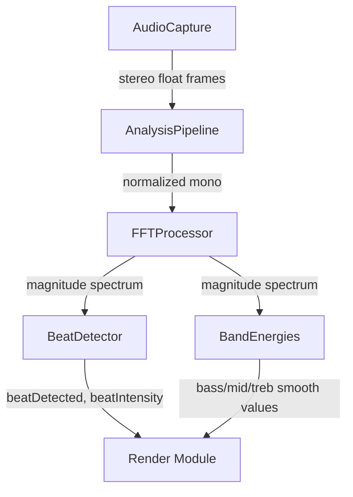

# Analysis Module
> Part of [AudioJones](../architecture.md)

## Purpose
Transforms raw audio samples into frequency spectrum, beat detection events, and band energy levels for visualization.

## Files
- **analysis_pipeline.h**: Defines AnalysisPipeline struct combining FFT, beat, and band processors
- **analysis_pipeline.cpp**: Coordinates audio normalization, FFT feeding, and downstream processing
- **fft.h**: Defines FFTProcessor struct and constants (2048-point FFT, 1025 bins, 512-sample hop)
- **fft.cpp**: Applies Hann window, executes KissFFT, computes magnitude spectrum with 75% overlap
- **beat.h**: Defines BeatDetector struct with spectral flux history and beat state
- **beat.cpp**: Detects beats via kick-band spectral flux with adaptive threshold and debounce
- **bands.h**: Defines BandEnergies struct and frequency ranges (bass/mid/treb matching MilkDrop)
- **bands.cpp**: Computes RMS energy per band with attack/release envelope smoothing

## Data Flow

## Internal Architecture

### FFT Processing
FFTProcessor accumulates mono samples in a 2048-sample buffer with 75% overlap (512-sample hop). Each update applies a precomputed Hann window, executes KissFFT real-to-complex transform, and computes magnitude for 1025 bins. At 48kHz sample rate, this produces ~94 spectrum updates per second.

### Beat Detection
BeatDetector tracks spectral flux in the kick drum frequency range (47-140 Hz, bins 2-6). A rolling history of 80 flux values (~850ms) provides mean and standard deviation for adaptive thresholding. Beats trigger when flux exceeds mean + 2 standard deviations, with 150ms debounce to prevent double-triggers. Beat intensity decays exponentially between detections.

### Band Energies
BandEnergies extracts RMS energy from three frequency ranges matching MilkDrop definitions: bass (20-250 Hz), mid (250-4000 Hz), treb (4000-20000 Hz). Each band applies attack/release envelope following (10ms attack, 150ms release) for smooth reactivity. Running averages with 1-second time constant enable normalization.

### Audio Normalization
The pipeline normalizes incoming audio before FFT processing. Peak tracking uses asymmetric attack/release (0.3 attack, 0.999 decay) to adapt to varying audio levels while maintaining consistent analysis sensitivity.

### Thread Safety
All processing occurs on the main thread. AudioCapture ring buffer provides thread-safe access to samples written by the audio callback thread.
