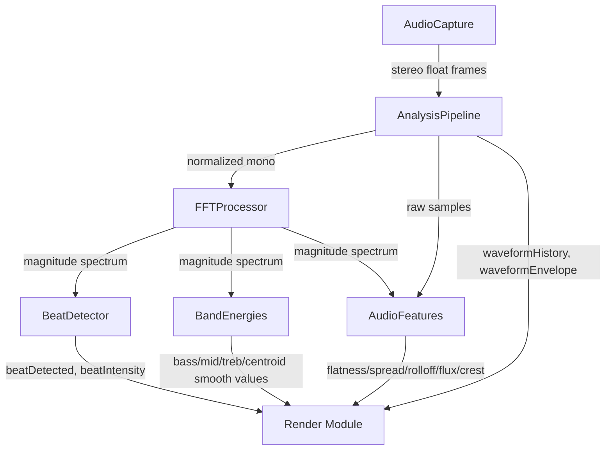

# Analysis Module
> Part of [AudioJones](../architecture.md)

## Purpose
Transforms raw audio samples into frequency spectrum, beat detection events, band energy levels, spectral features, and waveform history for visualization and modulation.

## Files
- **analysis_pipeline.h**: Defines AnalysisPipeline struct combining FFT, beat, band, and feature processors plus waveform history
- **analysis_pipeline.cpp**: Coordinates audio normalization, FFT feeding, downstream processing, and waveform envelope tracking
- **fft.h**: Defines FFTProcessor struct and constants (2048-point FFT, 1025 bins, 512-sample hop)
- **fft.cpp**: Applies Hann window, executes KissFFT, computes magnitude spectrum with 75% overlap
- **beat.h**: Defines BeatDetector struct with spectral flux history and beat state
- **beat.cpp**: Detects beats via kick-band spectral flux with adaptive threshold and debounce
- **bands.h**: Defines BandEnergies struct with frequency ranges (bass/mid/treb) and spectral centroid
- **bands.cpp**: Computes RMS energy per band, spectral centroid, and attack/release envelope smoothing
- **audio_features.h**: Defines AudioFeatures struct for flatness, spread, rolloff, flux, and crest factor
- **audio_features.cpp**: Extracts spectral characteristics from FFT magnitude and time-domain samples
- **smoothing.h**: Provides inline envelope follower and running average utilities for audio smoothing

## Data Flow

## Internal Architecture

### FFT Processing
FFTProcessor accumulates mono samples in a 2048-sample buffer with 75% overlap (512-sample hop). Each update applies a precomputed Hann window, executes KissFFT real-to-complex transform, and computes magnitude for 1025 bins. At 48kHz sample rate, this produces ~94 spectrum updates per second.

### Beat Detection
BeatDetector tracks spectral flux in the kick drum frequency range (47-140 Hz, bins 2-6). A rolling history of 80 flux values (~850ms) provides mean and standard deviation for adaptive thresholding. Beats trigger when flux exceeds mean + 2 standard deviations, with 150ms debounce to prevent double-triggers. Beat intensity decays exponentially between detections.

### Band Energies
BandEnergies extracts RMS energy from three frequency ranges matching MilkDrop definitions: bass (20-250 Hz), mid (250-4000 Hz), treb (4000-20000 Hz). Each band applies attack/release envelope following (10ms attack, 150ms release) for smooth reactivity. Running averages with 1-second time constant enable normalization. Spectral centroid computes the weighted average frequency (200-8000 Hz range, normalized 0-1) indicating brightness of the audio.

### Audio Features
AudioFeatures extracts five spectral characteristics for modulation sources. Flatness measures tone vs noise (geometric/arithmetic mean ratio). Spread computes bandwidth around the centroid. Rolloff finds the bin containing 85% of total energy. Flux tracks positive magnitude changes for onset detection (self-calibrating against running average). Crest factor measures peak/RMS ratio of time-domain samples (normalized by factor of 6). All features include raw, smoothed, and running average values.

### Waveform History
The pipeline maintains a 2048-sample waveform history for cymatics visualization. Each frame extracts the peak signed amplitude from the audio buffer, applies low-pass smoothing (alpha 0.1, ~2Hz response), and stores to a circular buffer. A dead zone snaps values below 0.01 to silence, preventing residual flicker.

### Audio Normalization
The pipeline applies instant peak normalization before FFT processing. Each audio buffer scales by 1/peak (minimum threshold 0.0001) to ensure volume-independent analysis regardless of source level.

### Thread Safety
All processing occurs on the main thread. AudioCapture ring buffer provides thread-safe access to samples written by the audio callback thread.
