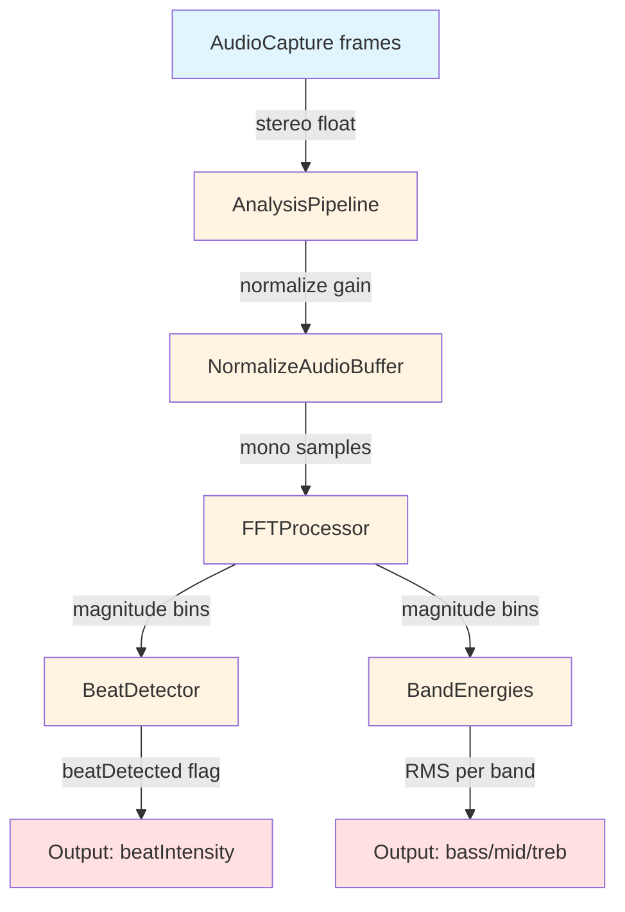

# Analysis Module
> Part of [AudioJones](../architecture.md)

## Purpose

Transforms raw audio samples into frequency-domain features: spectrum magnitudes via FFT, beat events from kick-band spectral flux, and smoothed energy per frequency band.

## Files

- **analysis_pipeline.h/cpp**: Orchestrates audio normalization, FFT feeding, and parallel beat/band processing per FFT update.
- **fft.h/cpp**: Converts stereo audio to mono, accumulates 2048-sample windows with 75% overlap, computes magnitude spectrum via kiss_fftr.
- **beat.h/cpp**: Detects kick drum transients using spectral flux (47-140 Hz) with adaptive threshold (mean + 2σ over 80-frame history).
- **bands.h/cpp**: Extracts RMS energy for bass/mid/treble bands with attack/release envelopes (10ms/150ms) and running averages.

## Data Flow

**Legend:**
- **Blue**: Input (raw audio frames)
- **Yellow**: Transform stages
- **Red**: Output (feature vectors for render)

## Internal Architecture

The pipeline chains three analyzers that execute sequentially per FFT update. The FFT processor accumulates samples until filling a 2048-sample buffer. It then hops forward 512 samples (75% overlap) to maintain temporal resolution. This overlap produces FFT updates at ~94 Hz, fast enough to catch transient beats.

The beat detector isolates kick drum frequencies (47-140 Hz, bins 2-6) and computes spectral flux: the sum of positive magnitude changes frame-to-frame. It maintains an 80-frame rolling history (~850ms) to calculate adaptive thresholds (mean + 2σ). Debouncing prevents retriggering within 150ms, ensuring distinct beat events even during sustained bass.

Band energies split the spectrum into three ranges matching MilkDrop conventions: bass (20-250 Hz), mid (250-4000 Hz), treble (4000-20000 Hz). Each band applies an attack/release envelope follower (10ms attack captures transients, 150ms release prevents jitter) and maintains a slow-decaying running average for normalization downstream.

The pipeline normalizes audio using adaptive gain control. Peak level tracks the buffer maximum with asymmetric attack/release (0.3 attack, 0.999 release). This prevents clipping during loud passages while maintaining sensitivity during quiet sections.

## Usage Patterns

Initialize via `AnalysisPipelineInit`, which allocates kiss_fftr state and zeroes all buffers. Call `AnalysisPipelineProcess` once per frame with the audio capture handle and delta time. The function reads available frames (up to `AUDIO_MAX_FRAMES_PER_UPDATE`), normalizes them, and feeds the FFT processor until all samples are consumed.

When the FFT buffer fills, `FFTProcessorUpdate` returns true and the pipeline immediately processes beat and band analyzers using the fresh magnitude spectrum. If no FFT update occurs (insufficient samples), beat detector still receives a process call with null magnitude to decay intensity smoothly.

Access results directly from the `AnalysisPipeline` struct: `beat.beatDetected` (boolean flag), `beat.beatIntensity` (0.0-1.0), `bands.bassSmooth/midSmooth/trebSmooth` (envelope-followed energies), and `fft.magnitude` (raw 1025-bin spectrum). Thread safety: single-threaded only, no internal synchronization.

Uninitialize via `AnalysisPipelineUninit` to free kiss_fftr resources. The Hann window is shared across all FFT instances and initialized once on first use.
