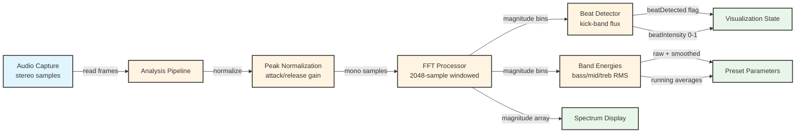

# Analysis Module
> Part of [AudioJones](../architecture.md)

## Purpose
Converts stereo audio samples into frequency-domain data, extracts beat events from kick-band spectral flux, and computes smoothed energy levels across bass/mid/treble bands.

## Files

- **analysis_pipeline.h/.cpp**: Orchestrates FFT, beat detection, and band processing with automatic gain normalization
- **fft.h/.cpp**: Transforms audio to frequency domain using 2048-sample FFT with 75% overlap and Hann windowing
- **beat.h/.cpp**: Detects kick drum onsets via spectral flux threshold with debouncing and intensity decay
- **bands.h/.cpp**: Calculates RMS energy for bass/mid/treble ranges with attack/release smoothing

## Data Flow

**Legend:**
- **Blue nodes** — External input (audio module)
- **Yellow nodes** — Internal processing stages
- **Green nodes** — External output (consumed by visualizers)

## Internal Architecture

### Pipeline Coordination
`AnalysisPipeline` reads stereo samples from `AudioCapture` and feeds them through a three-stage transform pipeline. Peak normalization precedes FFT processing to maintain consistent signal levels across varying source volumes. The normalizer tracks buffer peaks with asymmetric attack (0.3) and release (0.999) coefficients to prevent distortion while preserving transients.

### FFT Processing
`FFTProcessor` maintains a 2048-sample circular buffer with 512-sample hop size (75% overlap). Each hop triggers windowing with a shared Hann coefficient array, real-to-complex FFT via kiss_fftr, and magnitude extraction. The 48kHz sample rate yields 1025 bins at 23.4 Hz resolution, updated at ~94 Hz (512 samples / 48000 Hz).

### Beat Detection
`BeatDetector` isolates kick drum frequencies (47-140 Hz, bins 2-6) and computes spectral flux as the sum of positive magnitude changes. A rolling 80-sample history (~850ms) provides mean and standard deviation for adaptive thresholding (mean + 2σ). Detected beats trigger 150ms debouncing and set intensity proportional to threshold excess, which decays exponentially (0.1% per second).

### Band Energy Extraction
`BandEnergies` partitions the spectrum into three MilkDrop-compatible ranges: bass (20-250 Hz), mid (250-4kHz), treble (4-20kHz). RMS calculation over each range produces raw energy values. Attack/release smoothing (10ms attack, 150ms release) prevents jitter while preserving transients. Running averages (999-sample decay) support dynamic range normalization in downstream presets.

### Temporal Synchronization
The pipeline distinguishes between frame time (deltaTime from render loop) and audio hop time (512 samples / 48000 Hz). Beat detection and band smoothing use audio hop time when FFT updates occur, falling back to frame time during silence. This decouples beat timing accuracy from variable frame rates.

## Usage Patterns

### Initialization
Call `AnalysisPipelineInit()` after `AudioCaptureInit()` completes. The FFT processor allocates kiss_fftr configuration on the heap; other components use in-place initialization. Initialization failure returns false only if kiss_fftr allocation fails.

### Processing Loop
Invoke `AnalysisPipelineProcess()` once per frame, passing the `AudioCapture` instance and frame deltaTime. The function reads available audio (up to `AUDIO_MAX_FRAMES_PER_UPDATE`), normalizes it, and feeds chunks to the FFT processor. When FFT updates complete (every 512 samples), beat and band processors receive fresh magnitude data.

### Reading Results
Access FFT magnitude bins via `pipeline.fft.magnitude[FFT_BIN_COUNT]` for spectrum visualization. Beat state reads from `pipeline.beat.beatDetected` (bool) and `pipeline.beat.beatIntensity` (0-1 float). Band energies expose six fields: raw (bass/mid/treb), smoothed (bassSmooth/midSmooth/trebSmooth), and averages (bassAvg/midAvg/trebAvg).

### Thread Safety
All processing occurs on the main thread. The audio capture module uses internal locking for its ring buffer, but `AnalysisPipeline` assumes single-threaded access. Do not call processing functions from multiple threads.

### Resource Cleanup
Call `AnalysisPipelineUninit()` before program exit to free kiss_fftr configuration memory. Other resources (stack arrays, static Hann window) require no explicit cleanup.
