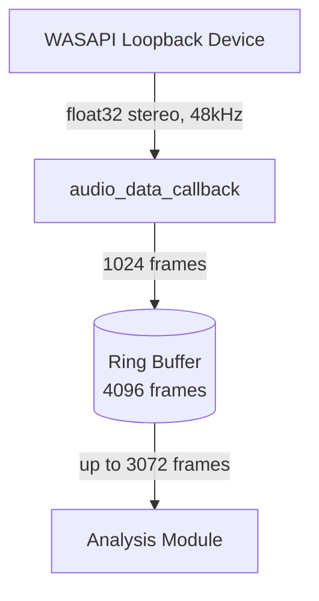

# Audio Module
> Part of [AudioJones](../architecture.md)

## Purpose
Captures system audio via WASAPI loopback and stores samples in a ring buffer for downstream analysis.

## Files
- **audio.h**: Public interface for capture lifecycle and buffer access
- **audio.cpp**: WASAPI loopback device initialization, capture callback, ring buffer read/write
- **audio_config.h**: Channel mode enumeration for stereo/mono selection

## Data Flow

## Internal Architecture

### Capture Device
`AudioCaptureInit` configures miniaudio with WASAPI backend for loopback capture. The device captures float32 stereo at 48kHz with 1024-frame periods. Device lifetime spans `AudioCaptureInit` to `AudioCaptureUninit`.

### Ring Buffer
`ma_pcm_rb` stores 4096 frames (85ms at 48kHz) between audio thread and main thread. The callback acquires write access, copies incoming frames, then commits. Readers acquire/commit similarly via `AudioCaptureRead`.

### Channel Modes
`AudioConfig` selects how stereo pairs reduce to mono for FFT:
- `CHANNEL_LEFT` / `CHANNEL_RIGHT`: Single channel
- `CHANNEL_MAX`: Larger magnitude with sign preserved
- `CHANNEL_MIX`: Average of left and right
- `CHANNEL_SIDE`: Left minus right (stereo difference)
- `CHANNEL_INTERLEAVED`: Raw alternating samples

### Thread Safety
Audio callback writes from miniaudio's audio thread. Main thread reads via `AudioCaptureRead`. miniaudio's `ma_pcm_rb` acquire/commit API provides lock-free synchronization through internal atomic pointers.
