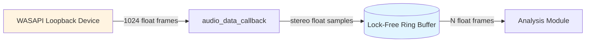

# Audio Module
> Part of [AudioJones](../architecture.md)

## Purpose

Captures system audio output via WASAPI loopback and buffers stereo samples into a lock-free ring buffer for real-time visualization processing.

## Files

- **audio_config.h**: Defines ChannelMode enum for stereo-to-mono conversion strategies (left, right, max, mix, side, interleaved)
- **audio.h/.cpp**: Implements miniaudio WASAPI loopback device, writes to ring buffer via callback thread, synchronizes concurrent read/write access

## Data Flow



**Legend:**
- Solid arrows: stereo float sample data (interleaved L/R channels)
- Cylinder shape: 4096-frame lock-free circular buffer (~85ms at 48kHz)
- Rectangle shape: process or external system component

## Internal Architecture

The module wraps miniaudio's device abstraction in an opaque `AudioCapture` struct that hides implementation details from consumers. Windows loopback capture requires WASAPI, so initialization forces the WASAPI backend explicitly.

A lock-free PCM ring buffer (`ma_pcm_rb`) decouples the audio callback thread from the main render loop. The callback writes incoming 1024-frame chunks without blocking; the main thread reads variable frame counts without stalling capture. This design prevents audio glitches from UI stalls or FFT processing delays.

Buffer sizing targets 4096 frames (85ms at 48kHz) to absorb frame rate variations while minimizing latency. The `AUDIO_MAX_FRAMES_PER_UPDATE` constant (3072 frames) caps single reads to prevent buffer underruns during slow frames.

The opaque pointer pattern (`typedef struct AudioCapture AudioCapture`) keeps miniaudio types out of the public header. Consumers see only primitive types and forward declarations, making the implementation swappable without recompiling dependents.

## Usage Patterns

Initialize the capture device before accessing audio data. Initialization allocates the ring buffer and configures the WASAPI loopback device but does not start capture:

```c
AudioCapture* capture = AudioCaptureInit();  // Returns NULL on failure
if (capture == NULL) {
    // Handle error - device unavailable or WASAPI unsupported
}
```

Start capture to begin filling the ring buffer from the system audio output:

```c
bool started = AudioCaptureStart(capture);  // Returns false if already started
```

Query available frames before reading to avoid unnecessary buffer allocations:

```c
uint32_t available = AudioCaptureAvailable(capture);
if (available >= minimumFrames) {
    uint32_t read = AudioCaptureRead(capture, buffer, frameCount);
    // read <= frameCount, process 'read' frames
}
```

`AudioCaptureRead` consumes samples from the ring buffer. It returns the actual frame count read, which may be less than requested if insufficient data exists. The function is non-blocking and safe to call every frame.

Stop capture when pausing visualization or during shutdown:

```c
AudioCaptureStop(capture);   // Stops device, retains buffer state
AudioCaptureUninit(capture); // Frees all resources, blocks until device stops
```

Thread safety: The ring buffer allows concurrent callback writes and main-thread reads without locks. Do not call API functions from multiple consumer threads simultaneously—single-threaded consumption only.
