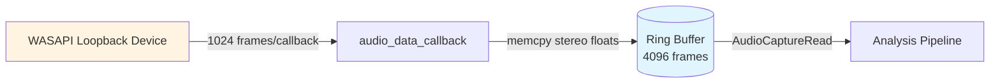

# Audio Module
> Part of [AudioJones](../architecture.md)

## Purpose

Captures system audio output via WASAPI loopback and buffers stereo samples into a lock-free ring buffer for real-time visualization processing.

## Files

- **audio.h/.cpp**: Implements miniaudio WASAPI loopback device with callback thread writing to lock-free ring buffer
- **audio_config.h**: Defines `ChannelMode` enum and `AudioConfig` struct for downstream stereo-to-mono conversion

## Data Flow



**Legend:**
- Solid arrows: stereo float32 samples (interleaved L/R channels at 48kHz)
- Cylinder: lock-free circular buffer (85ms capacity at 48kHz)
- Rectangle: process or external hardware

## Internal Architecture

The module wraps miniaudio's device abstraction in an opaque `AudioCapture` struct that hides implementation details from consumers. Windows loopback capture requires WASAPI, so `AudioCaptureInit` forces the WASAPI backend explicitly via `ma_device_init_ex`.

A lock-free PCM ring buffer (`ma_pcm_rb`) decouples the audio callback thread from the main render loop. The callback writes incoming 1024-frame chunks without blocking. The main thread reads variable frame counts without stalling capture. This design prevents audio glitches from UI stalls or FFT processing delays.

Buffer sizing targets 4096 frames (85ms at 48kHz) to absorb frame rate variations while minimizing latency. The `AUDIO_MAX_FRAMES_PER_UPDATE` constant (3072 frames) caps single reads to prevent excessive memory copies during slow frames.

The opaque pointer pattern (`typedef struct AudioCapture AudioCapture`) keeps miniaudio types out of the public header. Consumers see only primitive types and forward declarations. This makes the implementation swappable without recompiling dependents.

The callback thread executes `audio_data_callback` at hardware buffer intervals (1024 frames = 21ms at 48kHz). It acquires write space from the ring buffer, copies input samples via `memcpy`, and commits the write atomically. If the buffer overflows, frames are silently dropped to prevent blocking.

## Usage Patterns

Initialize the capture device before accessing audio data. Initialization allocates the ring buffer and configures the WASAPI loopback device but does not start capture:

```c
AudioCapture* capture = AudioCaptureInit();  // Returns NULL on failure
if (capture == NULL) {
    // Handle error - device unavailable or WASAPI unsupported
}
```

Start capture to begin filling the ring buffer from the system audio output:

```c
bool started = AudioCaptureStart(capture);  // Returns false if already started
```

Query available frames before reading to avoid unnecessary buffer allocations:

```c
uint32_t available = AudioCaptureAvailable(capture);
if (available >= minimumFrames) {
    uint32_t read = AudioCaptureRead(capture, buffer, frameCount);
    // read <= frameCount, process 'read' frames
}
```

`AudioCaptureRead` consumes samples from the ring buffer. It returns the actual frame count read, which may be less than requested if insufficient data exists. The function is non-blocking and safe to call every frame.

Stop capture when pausing visualization or during shutdown:

```c
AudioCaptureStop(capture);   // Stops device, retains buffer state
AudioCaptureUninit(capture); // Frees all resources, blocks until device stops
```

Thread safety: The ring buffer allows concurrent callback writes and main-thread reads without locks. Do not call API functions from multiple consumer threads simultaneously—single-threaded consumption only.

The `AudioConfig` struct in `audio_config.h` is not consumed by this module. It defines configuration for downstream modules (analysis pipeline) that convert stereo samples to mono using various channel modes (left, right, max, mix, side, interleaved).
