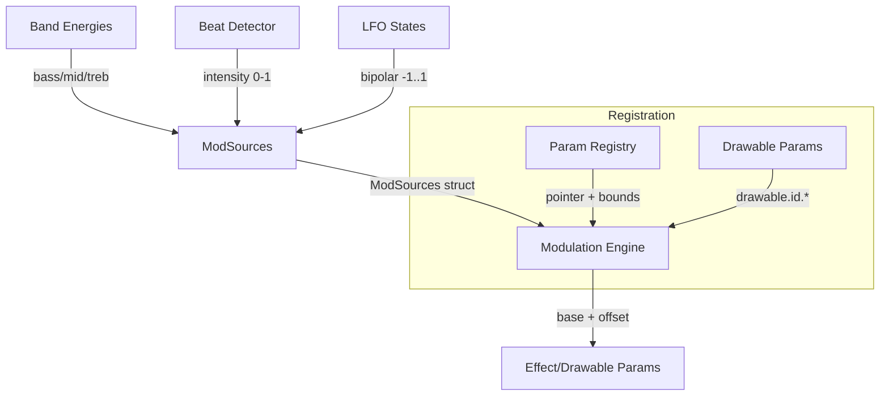

# Automation Module
> Part of [AudioJones](../architecture.md)

## Purpose
Routes audio-reactive and LFO signals to visual parameters, enabling time-varying modulation without manual keyframing.

## Files
- **easing.h**: Provides curve evaluation functions (cubic, spring, elastic, bounce) for modulation shaping
- **lfo.h/.cpp**: Generates waveforms (sine, triangle, saw, square, sample-hold) at configurable rates
- **mod_sources.h/.cpp**: Aggregates audio bands, beat intensity, and LFO outputs into normalized 0-1 or bipolar values
- **modulation_engine.h/.cpp**: Maps source signals to registered parameters via routes with amount and curve controls
- **param_registry.h/.cpp**: Defines parameter bounds for all effects (physarum, flow field, voronoi, blur, chromatic, kaleidoscope, mobius, attractorFlow, turbulence, infiniteZoom, radialStreak, tunnel) and drawable fields; registers pointers with the modulation engine
- **drawable_params.h/.cpp**: Registers drawable parameters (x, y, rotationSpeed, rotationAngle, and texAngle for shapes) with prefix-based cleanup

## Data Flow


## Internal Architecture

### LFO Generation
`LFOProcess` advances phase by `rate * deltaTime`, wrapping at 1.0. Five waveforms produce bipolar output:
- **Sine**: `sin(phase * TAU)`
- **Triangle**: linear ramp 0->1->-1 over full cycle
- **Sawtooth**: rising ramp -1 to 1
- **Square**: +1 first half, -1 second half
- **Sample-Hold**: random value latched at phase wrap

Each LFO maintains independent phase and held value. Config enables/disables output.

### Source Normalization
Audio sources self-calibrate using running averages. `ModSourcesUpdate` computes:
```
normalized = smoothed / max(average, epsilon)
output = min(normalized / 2.0, 1.0)
```
Beat intensity passes through directly. LFO outputs remain bipolar (-1 to 1).

### Modulation Routing
A `ModRoute` binds a parameter ID to a source with amount (-1 to +1) and curve type. Seven curve shapes transform source values via `BipolarEase` (preserves sign for negative inputs):
- **Linear**: identity pass-through
- **EaseIn**: cubic acceleration (`t^3`)
- **EaseOut**: cubic deceleration (`1 - (1-t)^3`)
- **EaseInOut**: smooth S-curve, cubic both ends
- **Spring**: damped oscillation with overshoot
- **Elastic**: sine-based overshoot with exponential decay
- **Bounce**: piecewise parabolic bounces

The engine computes: `modulated = base + (curved * amount * (max - min))`, clamped to bounds.

### Parameter Registry
Static table defines bounds for effect parameters: physarum, flow field, voronoi, blur, chromatic, kaleidoscope, mobius, attractorFlow, turbulence, infiniteZoom, radialStreak, tunnel. `ParamRegistryInit` registers each with its target pointer. A separate `DRAWABLE_FIELD_TABLE` defines bounds for drawable fields (x, y, rotationSpeed, rotationAngle, texAngle). Dynamic lookup via `ParamRegistryGetDynamic` first checks the static table, then matches `drawable.<id>.<field>` patterns against the drawable field table.

### Drawable Parameters
`DrawableParamsRegister` creates entries for each drawable's base fields: `drawable.<id>.x`, `drawable.<id>.y`, `drawable.<id>.rotationSpeed`, `drawable.<id>.rotationAngle`. For shapes, it also registers `drawable.<id>.texAngle`. `DrawableParamsUnregister` removes routes matching the prefix when a drawable is deleted. `DrawableParamsSyncAll` re-registers all drawables after array reorder.

### Thread Safety
All modulation runs on the main thread. No locks required. `ModEngineUpdate` iterates routes and writes directly to param pointers each frame.
