# Automation Module
> Part of [AudioJones](../architecture.md)

## Purpose

Routes modulation sources (audio bands, beat detection, LFOs) to effect parameters through configurable curves and amounts. Decouples audio analysis from effect control, allowing preset-independent parameter animation.

## Files

- **drawable_params.h/.cpp**: Registers drawable x/y position parameters with the modulation engine; supports bulk sync after reorder/delete
- **lfo.h/.cpp**: Generates five waveforms (sine, triangle, sawtooth, square, sample-hold) at configurable rates
- **mod_sources.h/.cpp**: Aggregates audio bands, beat detector, and LFO outputs into unified source array
- **modulation_engine.h/.cpp**: Routes modulation sources to registered parameters with curve shaping and clamping
- **param_registry.h/.cpp**: Registers effect parameters with min/max bounds for physarum, blur, flow field, and dynamic drawable params

## Data Flow

```mermaid
graph LR
    subgraph Inputs
        A[BandEnergies]
        B[BeatDetector]
        C[LFO Outputs]
    end

    subgraph Sources
        D[ModSources]
    end

    subgraph Engine
        E[ModRoute Table]
        F[ParamMeta Registry]
        G[Curve Shaper]
    end

    subgraph Outputs
        H[EffectConfig Pointers]
        I[Drawable x/y Pointers]
    end

    A -->|bass/mid/treb normalized| D
    B -->|beatIntensity 0-1| D
    C -->|bipolar -1 to 1| D
    D -->|values array| E
    E -->|source index| G
    F -->|base, min, max| G
    G -->|clamped result| H
    G -->|clamped result| I

    style D fill:#1a1a2e
    style E fill:#1a1a2e
    style F fill:#1a1a2e
    style G fill:#1a1a2e
```



**Legend:**
- Dark nodes: internal state
- Arrows show per-frame data flow during `ModEngineUpdate`

## Internal Architecture

The modulation engine maintains three synchronized hash maps: parameter metadata, active routes, and computed offsets. Registration happens once during init via `ParamRegistryInit`, which pairs string IDs with pointers to live effect config fields. Drawable parameters register dynamically via `DrawableParamsRegister`, using the naming convention `drawable.<id>.x` and `drawable.<id>.y`.

Each route specifies a source enum (bass/mid/treb/beat/LFO1-4), amount multiplier (-1 to +1), and curve type (linear/exp/squared). The curve shapes the raw source value before scaling by amount and parameter range. For example, routing bass to blur with amount 0.5 and exponential curve produces: `blur = base + (bass² * 0.5 * (max - min))`.

Audio sources normalize by running average to produce 0-1 values, where 1.0 equals 2x the recent average energy. LFO sources output bipolar -1 to +1 signals. This asymmetry requires UI to show appropriate range indicators per source type.

The engine stores base values separately from modulated values. When the user adjusts a param with active modulation, the offset remains constant but the base shifts. During preset save, `ModEngineWriteBaseValues` temporarily writes base values to all param pointers. After preset load, `ModEngineSyncBases` reads current values back into base storage.

When a drawable is deleted, `DrawableParamsUnregister` calls `ModEngineRemoveRoutesMatching` with the prefix `drawable.<id>.` to remove all routes targeting that drawable. After drawable array reorder or deletion, `DrawableParamsSyncAll` re-registers all drawables to update stale pointers.

LFOs run independently in the main loop, each maintaining phase and waveform state. The sample-hold mode generates new random values on phase wrap (crossing 1.0). Phase advances by `rate * deltaTime`, where rate is in Hz.

## Usage Patterns

Initialize the modulation engine before registering params:

```cpp
ModEngineInit();               // Clear all maps
ParamRegistryInit(&effects);   // Register all known params
LFOStateInit(&lfoStates[i]);   // Zero phase for each LFO

// Register drawable params after creating drawables
DrawableParamsRegister(&drawable);
```

Each frame, update sources before the engine:

```cpp
ModSourcesUpdate(&sources, &bands, &beat, lfoOutputs);
ModEngineUpdate(dt, &sources);  // Writes to effect config pointers
```

The UI sets routes through `ModEngineSetRoute`, which stores the route and begins modulation next frame. Remove routes with `ModEngineRemoveRoute`, which resets the param to its base value and zeros the offset. To remove all routes for a drawable, call `DrawableParamsUnregister(id)` which uses prefix matching internally.

For preset serialization, iterate routes with `ModEngineGetRouteCount` and `ModEngineGetRouteByIndex`. Before saving, call `ModEngineWriteBaseValues` to export unmodulated values. After loading, call `ModEngineSyncBases` to read new base values from config pointers. Call `ModEngineClearRoutes` to reset all params to base when switching presets.

Thread safety: none. All calls must happen on the main thread. LFO state and modulation engine use single-threaded `rand()` and unsynchronized maps.
