# Automation Module
> Part of [AudioJones](../architecture.md)

## Purpose

Maps audio analysis signals and LFO waveforms to visual effect parameters through a routing system that applies curve transforms and range scaling.

## Files

- **lfo.h / lfo.cpp**: Generates periodic waveforms (sine, triangle, sawtooth, square, sample & hold) at configurable rates
- **mod_sources.h / mod_sources.cpp**: Aggregates audio bands, beat detector, and LFO outputs into a unified modulation source array
- **modulation_engine.h / modulation_engine.cpp**: Routes modulation sources to registered parameters with curve shaping and bipolar scaling
- **param_registry.h / param_registry.cpp**: Registers effect parameters (physarum, blur, flow field) with the modulation engine at startup

## Data Flow

```mermaid
flowchart TD
    subgraph Sources
        A1[Band Energies] --> MS[ModSources]
        A2[Beat Detector] --> MS
        A3[LFO State 1-4] --> MS
    end

    subgraph Engine
        MS -->|float values 0-8| ME[ModEngine]
        PR[ParamRegistry] -.->|registers pointers| ME
        ROUTES[ModRoute Table] -->|paramId → source/amount/curve| ME
        ME -->|base + curved offset| PTRS[Effect Parameter Pointers]
    end

    subgraph Output
        PTRS -->|sensorDistance| P1[Physarum Config]
        PTRS -->|blurScale| P2[Effect Config]
        PTRS -->|zoomBase| P3[Flow Field Config]
    end

    style MS fill:#1a1a2e
    style ME fill:#1a1a2e
    style PTRS fill:#16213e
```

**Legend:**
- Solid arrows: data flow per frame
- Dotted arrows: registration at initialization
- Subgraphs: functional boundaries

## Internal Architecture

The module separates signal generation (LFO, ModSources) from routing logic (ModEngine) to enable dynamic reconfiguration without recompiling the parameter list. The ModEngine maintains three parallel hash maps keyed by parameter ID string: metadata (pointer, min, max, base), routes (source, amount, curve), and computed offsets. This design allows the UI to modify routing without invalidating parameter registrations.

LFOs generate bipolar signals (-1 to 1) while audio sources produce unipolar (0 to 1) after self-calibrating normalization. The engine applies curve transforms (linear, exponential, squared) before scaling by the amount and parameter range. Base values store the unmodulated parameter state and survive route changes. When a route is removed, the engine restores the base value.

The ParamRegistry builds a static table of parameter IDs mapped to EffectConfig field pointers. This table centralizes all modulatable parameters and their valid ranges. During initialization, the registry calls ModEngineRegisterParam for each entry, establishing the indirection layer that allows the config module to load/save routing configurations independently of the parameter definitions.

## Usage Patterns

**Initialization Sequence:**
1. Call ModEngineInit to clear internal maps
2. Call ParamRegistryInit with pointer to EffectConfig structure
3. Call LFOStateInit for each of four LFO instances
4. Load routing configuration via ModulationConfigToEngine (optional)

**Per-Frame Update:**
1. Call ModSourcesUpdate with latest band energies, beat detector, and LFO outputs
2. Call LFOProcess for each LFO to advance phase and generate output
3. Call ModEngineUpdate with delta time and aggregated ModSources
4. Engine writes modulated values directly to registered parameter pointers

**Thread Safety:** Single-threaded only. All functions assume exclusive access to internal state and registered parameters.

**Configuration Persistence:** ModulationConfig provides JSON serialization for routes. Call ModulationConfigFromEngine before saving presets and ModulationConfigToEngine after loading to synchronize with the engine's runtime state.
