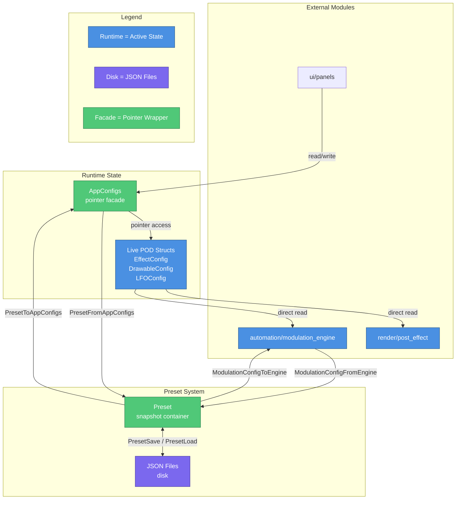

# Config Module
> Part of [AudioJones](../architecture.md)

## Purpose

Centralizes all runtime parameters as POD structs with defaults, enabling JSON serialization for preset save/load and bidirectional conversion with the active application state.

## Files

- **drawable_config.h**: Drawable visual parameters (position, rotation, color) for waveforms, spectrum bars, and shapes
- **effect_config.h**: Post-processing parameters (trails, kaleidoscope, voronoi, flow field, physarum)
- **lfo_config.h**: Low-frequency oscillator settings (waveform type, rate, enabled flag)
- **modulation_config.h/.cpp**: Modulation routing table with JSON serialization and engine sync
- **band_config.h**: Reserved placeholder for future frequency band settings
- **app_configs.h**: Aggregates runtime pointers to all live config structs for UI/preset access
- **preset.h/.cpp**: Top-level preset container with file I/O and nlohmann/json serialization

## Data Flow

**Legend:**
- **Runtime** — Active configuration state accessed by render/UI
- **Disk** — Persistent JSON preset files
- **Facade** — Pointer aggregators avoiding global state

## Internal Architecture

The config module separates **live mutable state** from **preset snapshots**. UI panels and render systems directly access POD structs through `AppConfigs`, a pointer facade that avoids passing individual references throughout the codebase. Each struct initializes fields inline, ensuring deterministic defaults without explicit constructors.

`Preset` acts as a snapshot container that copies values from live state via `PresetFromAppConfigs`. This function calls `ModEngineWriteBaseValues` to capture unmodulated parameters before serialization. On load, `PresetToAppConfigs` restores values and invokes `ModulationConfigToEngine` to reconstruct routing tables.

`ModulationConfig` bridges JSON persistence and the runtime modulation engine. The engine stores routes indexed by parameter ID strings. `ModulationConfigFromEngine` iterates engine routes into a fixed array, while `ModulationConfigToEngine` calls `ModEngineSyncBases` to capture new preset values, clears existing routes, then repopulates the engine from the config array.

`Drawable` uses a tagged union to minimize memory. The `type` enum selects between `WaveformData`, `SpectrumData`, and `ShapeData`, each storing type-specific visuals like bar height, amplitude scale, or polygon sides. The `path` enum chooses between linear and circular layout. Copy constructor and assignment operator manually replicate the active union member based on the type field.

Color configuration supports three modes: solid, rainbow (hue sweep), and gradient (interpolated stops). `ColorConfig` stores all mode data simultaneously. The gradient stop array remains sorted by position after deserialization, enforced via `std::sort`.

JSON serialization lives entirely in `preset.cpp` and `modulation_config.cpp`. These files isolate STL dependencies behind nlohmann/json macros. Headers forward-declare `nlohmann::json` to prevent STL leakage into headers.

## Usage Patterns

Main allocates all config structs on the stack and bundles pointers into `AppConfigs`. UI panels receive this facade and dereference fields directly. Render functions accept raw config pointers, avoiding indirection overhead in tight loops.

To save a preset, call `PresetFromAppConfigs` to snapshot current state, then `PresetSave` with a filepath. Loading reverses: `PresetLoad` populates a `Preset`, then `PresetToAppConfigs` writes values back to live memory. Both operations preserve modulation routing.

Adding a new parameter requires:
1. Add field to relevant config struct with inline default
2. Add JSON serialization macro in `preset.cpp`
3. Verify bidirectional copy in `PresetFromAppConfigs` / `PresetToAppConfigs`

Modulation routes store parameter IDs as fixed 64-byte strings. The ID must match the string registered in `modulation_engine`. Routes with empty IDs are skipped during engine restoration.

Thread safety: all config reads/writes occur on the main thread. Audio and render threads receive copied snapshots at frame boundaries, preventing data races without locks.
