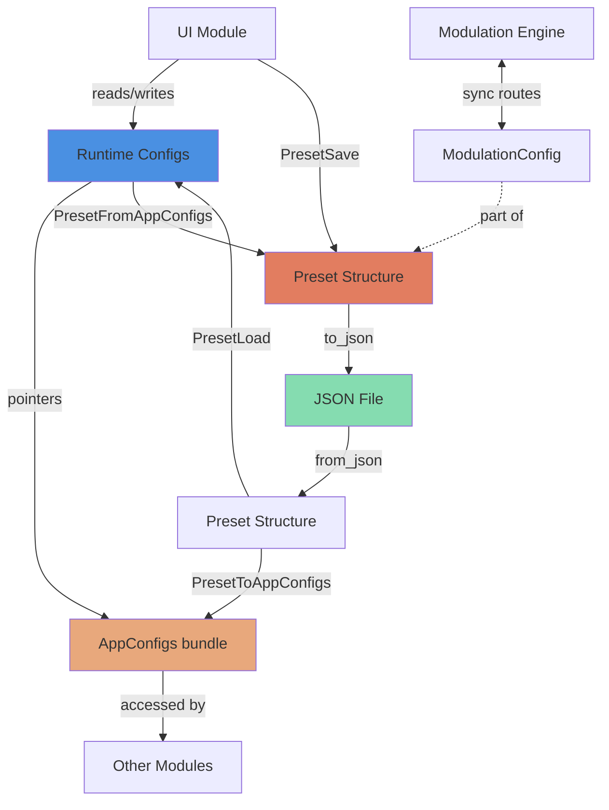

# Config Module
> Part of [AudioJones](../architecture.md)

## Purpose

Defines parameter structures for all modules and serializes them to JSON presets. Bridges runtime state with persistent storage.

## Files

- **preset.h/cpp**: Aggregates all configs into preset bundles, serializes JSON and reads/writes files
- **app_configs.h**: Pointer bundle for runtime config access across modules
- **effect_config.h**: Post-processing parameters (trails, bloom, kaleidoscope, flow field, physarum)
- **waveform_config.h**: Per-waveform visual parameters (radius, thickness, rotation, color)
- **spectrum_bars_config.h**: Frequency analyzer visual parameters (radial bars, smoothing, color)
- **modulation_config.h/cpp**: Serialization bridge between automation routes and preset files
- **lfo_config.h**: Low-frequency oscillator parameters (rate, waveform type)
- **band_config.h**: Reserved placeholder for future frequency band settings

## Data Flow

**Legend:**
- Solid arrows: Data flow
- Dotted arrows: Contains/part-of relationship
- Blue: Runtime state
- Orange: Serialization structures
- Green: Persistent storage
- Tan: Pointer bundles

## Internal Architecture

The module separates concerns into three layers: runtime pointers, config structures, and serialization.

**AppConfigs** holds pointers to live configuration structs owned by other modules. This bundle passes through UI code, avoiding global state while maintaining single-source-of-truth for parameters. The pointer indirection allows UI controls to modify values directly without callbacks.

**Config structs** use in-class initializers for defaults. Each struct corresponds to a functional domain (effects, waveforms, spectrum). Nested composition mirrors the visual hierarchy: `Preset` contains arrays of `WaveformConfig`, each containing `ColorConfig`.

**Preset serialization** leverages nlohmann/json macros for automatic struct-to-JSON conversion. The `NLOHMANN_DEFINE_TYPE_NON_INTRUSIVE_WITH_DEFAULT` macro generates serializers that preserve defaults when fields are missing. Custom serializers for `ColorConfig` and `ModulationConfig` handle variable-length arrays and validation.

**Modulation bridge** synchronizes the automation engine's internal route table with preset files. `PresetFromAppConfigs` calls `ModEngineWriteBaseValues` to snapshot unmodulated parameters before save. `PresetToAppConfigs` calls `ModulationConfigToEngine` to rebuild route table from deserialized data.

**File I/O** wraps C++ exceptions in boolean returns to maintain C-style error handling. `PresetListFiles` creates the preset directory if missing, enabling zero-config first runs.

Trade-offs: STL usage violates project conventions but remains isolated to `preset.cpp` and `modulation_config.cpp`. The serialization clarity and filesystem utilities justify the exception. All STL symbols stay out of headers via forward declarations.

## Usage Patterns

Initialize configs with in-class defaults or explicit constructors. No Init/Uninit functions exist; structs are POD-compatible.

Pass `AppConfigs*` to UI code for read/write access. Other modules receive individual config pointers through their Init functions.

Save workflow: UI calls `PresetFromAppConfigs` to populate `Preset` from runtime state, then `PresetSave` to write JSON. Load workflow: `PresetLoad` reads JSON into `Preset`, then `PresetToAppConfigs` copies values to runtime configs via `AppConfigs` pointers.

Modulation routes require special handling: always call `ModEngineWriteBaseValues` before saving to capture unmodulated base values. After loading, `ModulationConfigToEngine` clears existing routes before applying preset routes.

Thread safety: No internal synchronization. Caller must ensure single-threaded access during save/load operations. Runtime config reads are safe if modulation engine is paused.
