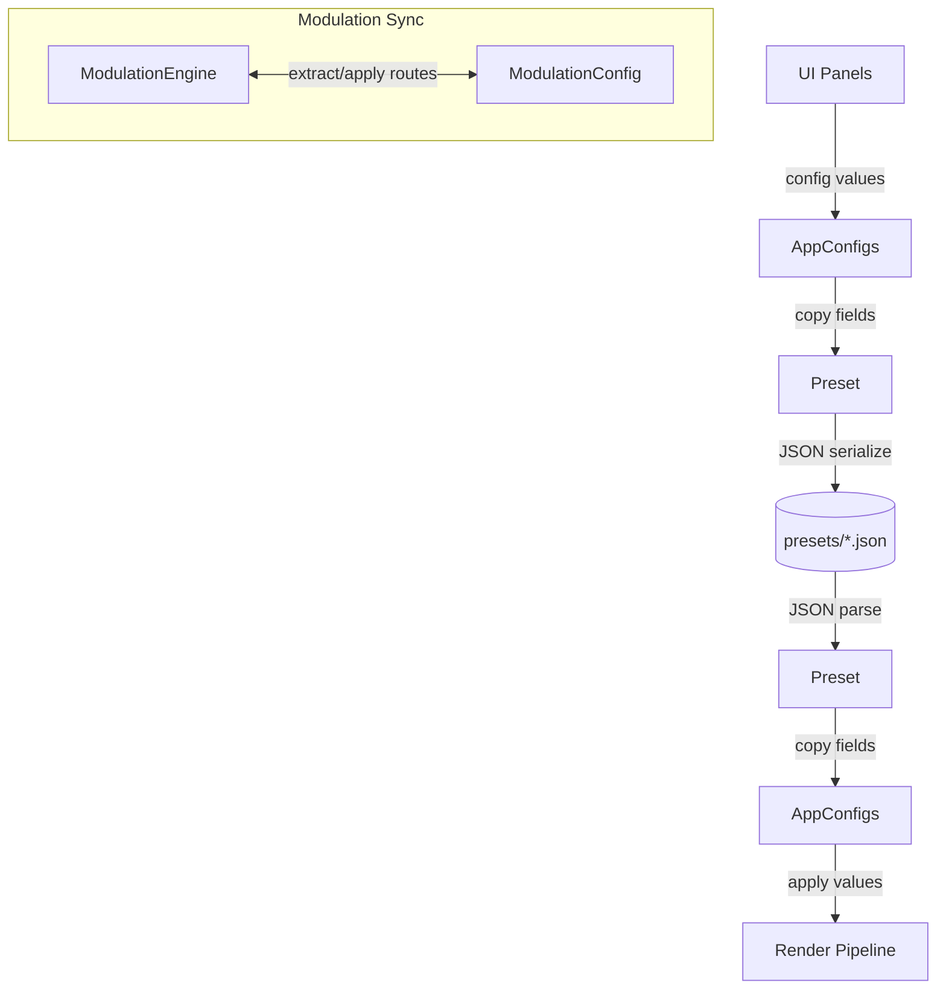

# Config Module
> Part of [AudioJones](../architecture.md)

## Purpose
Defines configuration structures for all visual and audio parameters, with JSON serialization for preset save/load.

## Files
- **app_configs.h**: Aggregates pointers to all runtime config structures
- **ascii_art_config.h**: Defines ASCII art effect parameters (cellSize, colorMode, foreground/background colors)
- **band_config.h**: Reserved placeholder for band-related settings
- **color_grade_config.h**: Defines color grading parameters (hueShift, saturation, brightness, contrast, temperature, lift/gamma/gain)
- **drawable_config.h**: Defines Drawable types (waveform, spectrum, shape) with display parameters
- **droste_zoom_config.h**: Defines Droste recursive zoom parameters (speed, scale, spiralAngle, shearCoeff, innerRadius, branches)
- **effect_config.h**: Defines post-processing effects with TransformOrderConfig for 22 reorderable transform types
- **glitch_config.h**: Defines video corruption parameters (CRT barrel distortion, analog noise, digital block glitches, VHS tracking)
- **gradient_flow_config.h**: Defines edge-following UV displacement parameters (strength, iterations, flowAngle, edgeWeight)
- **heightfield_relief_config.h**: Defines luminance-based embossed lighting parameters (reliefScale, lightAngle, lightHeight, shininess)
- **infinite_zoom_config.h**: Defines layered zoom parameters (speed, zoomDepth, layers, spiralAngle, spiralTwist)
- **kaleidoscope_config.h**: Defines polar wedge mirroring parameters (segments, rotationSpeed, twistAngle, smoothing, focalAmplitude, fBM warp)
- **kifs_config.h**: Defines KIFS fractal folding parameters (iterations, scale, offsetX/Y, rotationSpeed, twistAngle, octantFold, polarFold)
- **lattice_fold_config.h**: Defines grid-based tiling parameters (cellType, cellScale, rotationSpeed)
- **lfo_config.h**: Defines LFO waveform types and oscillator settings
- **mobius_config.h**: Defines two-point conformal warp parameters (point1/point2 positions, spiralTightness, zoomFactor, Lissajous animation)
- **modulation_config.h**: Declares modulation route storage and engine sync interface
- **modulation_config.cpp**: Serializes ModRoute arrays to JSON, syncs with ModulationEngine
- **neon_glow_config.h**: Defines Sobel edge glow parameters (glowR/G/B, edgeThreshold, glowIntensity, glowRadius)
- **oil_paint_config.h**: Defines Kuwahara filter parameters (radius)
- **pixelation_config.h**: Defines UV quantization parameters (cellCount, posterizeLevels, ditherScale)
- **poincare_disk_config.h**: Defines hyperbolic tiling parameters (tileP/Q/R angles, translationX/Y, diskScale, rotationSpeed)
- **preset.h**: Declares Preset structure and save/load/list API
- **preset.cpp**: Serializes all config types to JSON via nlohmann/json
- **radial_streak_config.h**: Defines radial motion blur parameters (samples, streakLength)
- **sine_warp_config.h**: Defines cascaded sine distortion parameters (octaves, strength, animSpeed, octaveRotation, uvScale)
- **texture_warp_config.h**: Defines self-referential UV distortion parameters (strength, iterations, channelMode)
- **toon_config.h**: Defines cartoon posterization parameters (levels, edgeThreshold, edgeSoftness, thicknessVariation)
- **voronoi_config.h**: Defines Voronoi cell effect parameters (scale, speed, edgeFalloff, isoFrequency, intensity sliders)
- **watercolor_config.h**: Defines watercolor simulation parameters (edgeDarkening, granulationStrength, paperScale, bleedStrength)
- **wave_ripple_config.h**: Defines pseudo-3D radial wave parameters (octaves, strength, frequency, steepness, originX/Y, shading)

## Data Flow

## Internal Architecture

### Configuration Structures
`EffectConfig` aggregates all post-processing parameters: trail persistence (`halfLife`), blur radius, chromatic aberration offset, feedback desaturation, gamma correction, clarity enhancement, and nested `FlowFieldConfig` plus 22 transform effect configs. `TransformOrderConfig` stores a `TRANSFORM_EFFECT_COUNT`-element array specifying shader transform execution order. Each struct uses in-class member defaults, eliminating explicit initialization.

`InfiniteZoomConfig` defines layered zoom parameters: speed, zoomDepth (zoom range in powers of 2), layer count (2-8), spiralAngle (uniform rotation per cycle), spiralTwist (radius-dependent via log(r)).

`KaleidoscopeConfig` defines polar wedge mirroring with segments, rotationSpeed, twistAngle, smoothing at wedge seams, focal Lissajous amplitude/frequency, and fBM warp parameters. Legacy KIFS/hex fields remain for backward compatibility but are deprecated.

`KifsConfig` defines fractal folding: iterations, scale, offsetX/Y translation, rotationSpeed, twistAngle per iteration, optional octantFold (8-way symmetry), and optional polarFold with configurable segment count.

`Drawable` defines three types via discriminated union: waveform (circular audio trace), spectrum (radial frequency bars), shape (textured polygon). `DrawablePath` enum selects linear or circular path rendering. `DrawableBase` holds common fields: position, rotation, color mode. The union stores type-specific data without memory overhead.

### Preset Serialization
`preset.cpp` uses nlohmann/json with `NLOHMANN_DEFINE_TYPE_NON_INTRUSIVE_WITH_DEFAULT` macros for automatic field binding. Custom `to_json`/`from_json` functions serialize ColorConfig gradients and Drawable unions by switch on type enum. Gradient deserialization validates stop count and sorts by position.

`PresetSave` writes indented JSON to file. `PresetLoad` parses and applies defaults for missing fields. `PresetListFiles` scans a directory for `.json` files.

### App Config Bridge
`AppConfigs` holds pointers to live config structures owned by main. `PresetFromAppConfigs` copies current values into a Preset, calling `ModEngineWriteBaseValues` first to capture unmodulated parameter states. `PresetToAppConfigs` applies preset values back, unregistering stale drawable params and resyncing the modulation engine.

### Modulation Config
`ModulationConfig` stores up to 64 `ModRoute` entries extracted from the modulation engine. `ModulationConfigFromEngine` queries active routes. `ModulationConfigToEngine` clears existing routes and applies stored routes to the engine.

### Thread Safety
All config reads and writes occur on the main thread during UI interaction or preset load. No synchronization required.
