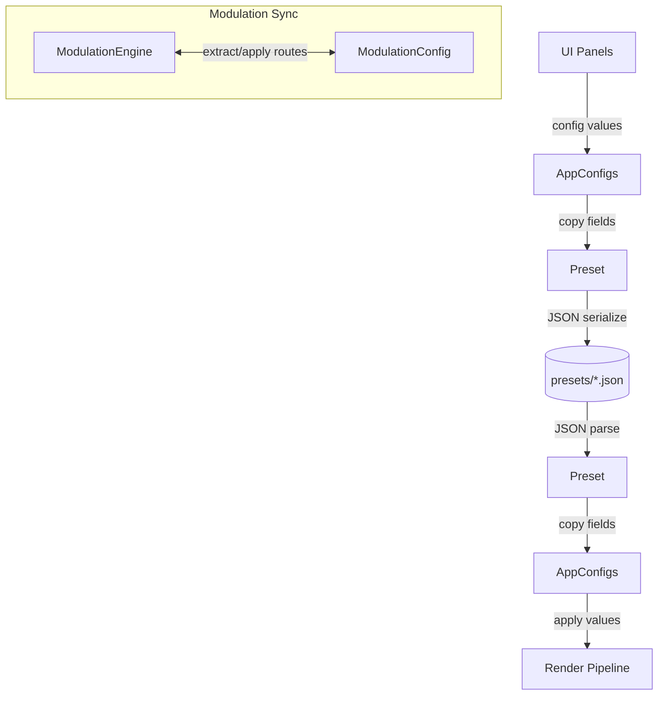

# Config Module
> Part of [AudioJones](../architecture.md)

## Purpose
Defines configuration structures for all visual and audio parameters, with JSON serialization for preset save/load.

## Files
- **app_configs.h**: Aggregates pointers to all runtime config structures
- **band_config.h**: Reserved placeholder for band-related settings
- **drawable_config.h**: Defines Drawable types (waveform, spectrum, shape) with display parameters
- **effect_config.h**: Defines post-processing effects with TransformOrderConfig for reorderable transform chain
- **infinite_zoom_config.h**: Defines infinite zoom parameters (speed, zoomDepth, layers, spiralAngle, spiralTwist, focal Lissajous)
- **kaleidoscope_config.h**: Defines kaleidoscope mode enum and polar/KIFS fractal parameters
- **lfo_config.h**: Defines LFO waveform types and oscillator settings
- **mobius_config.h**: Defines iterated Mobius transform parameters (iterations, poleMagnitude, animSpeed, uvScale)
- **modulation_config.h**: Declares modulation route storage and engine sync interface
- **modulation_config.cpp**: Serializes ModRoute arrays to JSON, syncs with ModulationEngine
- **multi_inversion_config.h**: Defines chained circle inversion parameters (iterations, radius, Lissajous path animation)
- **preset.h**: Declares Preset structure and save/load/list API
- **preset.cpp**: Serializes all config types to JSON via nlohmann/json
- **radial_streak_config.h**: Defines radial/spiral motion streak parameters (samples, streakLength, spiralTwist)
- **tunnel_config.h**: Defines polar tunnel effect parameters (speed, layers, depth, winding Lissajous path)
- **turbulence_config.h**: Defines sine-based turbulence cascade parameters (octaves, strength, octaveTwist)
- **voronoi_config.h**: Defines Voronoi cell effect parameters

## Data Flow

## Internal Architecture

### Configuration Structures
`EffectConfig` aggregates all post-processing parameters: trail persistence (`halfLife`), blur radius, chromatic aberration offset, feedback desaturation, gamma correction, clarity enhancement, and nested `FlowFieldConfig`, `KaleidoscopeConfig`, `VoronoiConfig`, `PhysarumConfig`, `CurlFlowConfig`, `InfiniteZoomConfig`, `AttractorFlowConfig`, `MobiusConfig`, `TurbulenceConfig`, `RadialStreakConfig`, `MultiInversionConfig`, `TunnelConfig`. `TransformOrderConfig` stores an 8-element array specifying shader transform execution order. Each struct uses in-class member defaults, eliminating explicit initialization.

`InfiniteZoomConfig` defines layered zoom parameters: speed, zoomDepth (zoom range in powers of 2), layer count (2-8), spiralAngle (uniform rotation per cycle), spiralTwist (radius-dependent via log(r)), and Lissajous focal animation (amplitude, freqX, freqY).

`KaleidoscopeConfig` defines two modes via `KaleidoscopeMode` enum: `KALEIDO_POLAR` (standard polar mirroring with segments, twist, focal Lissajous, fBM warp) and `KALEIDO_KIFS` (kaleidoscopic IFS fractal folding with iteration count, scale, and offset).

`DrawableConfig` defines three drawable types via discriminated union: waveform (circular audio trace), spectrum (radial frequency bars), shape (textured polygon). `DrawablePath` enum selects linear or circular path rendering. `DrawableBase` holds common fields: position, rotation, color mode. The union stores type-specific data without memory overhead.

### Preset Serialization
`preset.cpp` uses nlohmann/json with `NLOHMANN_DEFINE_TYPE_NON_INTRUSIVE_WITH_DEFAULT` macros for automatic field binding. Custom `to_json`/`from_json` functions serialize ColorConfig gradients and Drawable unions by switch on type enum. Gradient deserialization validates stop count and sorts by position.

`PresetSave` writes indented JSON to file. `PresetLoad` parses and applies defaults for missing fields. `PresetListFiles` scans a directory for `.json` files.

### App Config Bridge
`AppConfigs` holds pointers to live config structures owned by main. `PresetFromAppConfigs` copies current values into a Preset, calling `ModEngineWriteBaseValues` first to capture unmodulated parameter states. `PresetToAppConfigs` applies preset values back, unregistering stale drawable params and resyncing the modulation engine.

### Modulation Config
`ModulationConfig` stores up to 64 `ModRoute` entries extracted from the modulation engine. `ModulationConfigFromEngine` queries active routes. `ModulationConfigToEngine` clears existing routes and applies stored routes to the engine.

### Thread Safety
All config reads and writes occur on the main thread during UI interaction or preset load. No synchronization required.
