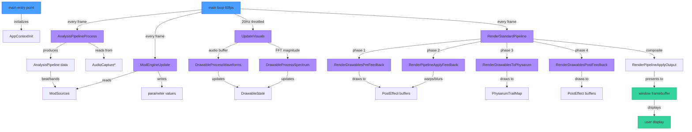

# Main Module
> Part of [AudioJones](../architecture.md)

## Purpose

Orchestrates the entire application lifecycle: initializes subsystems, routes audio through analysis and modulation pipelines, renders visuals at 60fps with 20Hz update throttling, and manages ImGui-based configuration UI.

## Files

- **main.cpp**: Application entry point, main loop, and subsystem coordination

## Data Flow

**Legend:**
- Blue nodes: entry points (initialization, main loop)
- Purple nodes: data transforms (analysis, modulation, rendering)
- Green nodes: exit points (screen output)

## Internal Architecture

The main module owns all subsystem lifetimes through a single `AppContext` aggregate. It allocates this context on the heap during startup and deallocates during shutdown, ensuring deterministic resource cleanup via `AppContextUninit`.

### Initialization Chain

Two macros enforce fail-fast semantics during startup:
- `INIT_OR_FAIL` assigns subsystem pointers and aborts if NULL
- `CHECK_OR_FAIL` validates boolean operations and aborts on failure

Both trigger `AppContextUninit` to release any already-initialized resources. This prevents partial initialization states from leaking memory or handles.

The init sequence creates:
1. PostEffect system (framebuffers, shaders)
2. AudioCapture (WASAPI loopback)
3. DrawableState (one default waveform)
4. AnalysisPipeline (FFT, beat detector)
5. ModEngine with 4 LFOs and parameter registry

### Update Cadence

The main loop decouples visual refresh from analysis accuracy:
- **Audio analysis**: every frame (60fps) for precise beat detection
- **Modulation engine**: every frame to track parameter changes
- **Visual updates**: 20Hz throttled via accumulator, sufficient for smooth display
- **Rendering**: every frame for 60fps output

This split prevents expensive waveform/spectrum computation from blocking beat detection.

### Render Pipeline

The standard pipeline splits drawable rendering into four phases to control feedback integration:

**Phase 1 - Pre-Feedback**: Draws each drawable at opacity `(1 - feedbackPhase)` before feedback effects. These get integrated into warp and blur transforms.

**Phase 2 - Feedback**: Applies temporal effects (motion blur, decay, warp) to accumulated framebuffer content using FFT magnitude for audio reactivity.

**Phase 3 - Physarum Trails**: Renders all drawables at full opacity to a separate trail map texture. Physarum agents sense this map to guide movement.

**Phase 4 - Post-Feedback**: Draws each drawable at opacity `feedbackPhase` after feedback. These appear crisp on top of warped history.

The `feedbackPhase` parameter (0.0 to 1.0) controls the crisp/integrated balance per drawable. At 0.0, drawables fully integrate into feedback. At 1.0, they render entirely crisp on top.

### UI Integration

The main loop toggles UI visibility via Tab key (when ImGui doesn't capture keyboard). It bundles all mutable state into `AppConfigs` struct and passes to panel functions. Each panel mutates its slice of config through direct pointer access.

## Usage Patterns

This module serves as the application root and does not expose an API to other modules. External modules integrate by registering with subsystems owned by `AppContext`:

**Audio Processing**: Subscribe to `AudioCapture` for raw samples or `AnalysisPipeline` for FFT/beat data.

**Rendering**: Implement drawable types via `DrawableState` interface or post-effects via `PostEffect` chain.

**Modulation**: Register parameters via `ParamRegistry` to receive automated value updates from LFOs or audio reactivity.

**Configuration**: Add panels to `imgui_panels.h` that read/write pointers passed through `AppConfigs`.

The main loop guarantees update order: audio analysis → modulation → visual update (throttled) → render. Modules can rely on this sequencing for data dependencies.
