# Main Module
> Part of [AudioJones](../architecture.md)

## Purpose
Orchestrates the application lifecycle, connecting audio capture, analysis, modulation, rendering, and UI subsystems. Owns the main event loop and sequences resource initialization and cleanup.

## Files
- **src/main.cpp**: Application entry point, subsystem initialization, main event loop, and render pipeline orchestration.

## Data Flow

```mermaid
flowchart TD
    Start([Program Entry]) -->|init request| Init[AppContextInit]
    Init -->|screen dimensions| PostEffect[PostEffect]
    Init -->|start capture| Audio[AudioCapture]
    Init -->|allocate| Analysis[AnalysisPipeline]
    Init -->|allocate| Waveform[WaveformPipeline]
    Init -->|allocate| Spectrum[SpectrumBars]
    Init -->|register params| ModEngine[ModulationEngine]
    Init -->|AppContext*| Loop[Main Loop]

    Loop -->|raw PCM frames| AnalysisStep[AnalysisPipelineProcess]
    AnalysisStep -->|FFT magnitudes + beat state| Analysis

    Loop -->|delta time| LFOUpdate[LFO Processing]
    LFOUpdate -->|LFO outputs 0-3| ModSources[ModSourcesUpdate]
    Analysis -->|band energies + beat| ModSources
    ModSources -->|mod source values| ModEngineUpdate[ModEngineUpdate]
    ModEngineUpdate -->|modulated param values| Params[PostEffect.effects]

    Loop -->|20Hz timer| VisualUpdate[UpdateVisuals]
    Analysis -->|FFT magnitudes| VisualUpdate
    VisualUpdate -->|spectrum heights| Spectrum
    Analysis -->|raw PCM buffer| VisualUpdate
    VisualUpdate -->|point arrays| Waveform

    Loop -->|RenderContext| RenderPipeline[RenderStandardPipeline]
    Analysis -->|FFT magnitudes| RenderPipeline
    RenderPipeline -->|feedback pass| PostEffect
    RenderPipeline -->|waveforms| PhysarumTrail[Physarum Trail Map]
    RenderPipeline -->|waveforms| AccumBuffer[Accumulator Buffer]
    RenderPipeline -->|composite layers| Screen[Screen Output]

    Loop -->|AppConfigs| UI[ImGui Panels]
    UI -->|config changes| Params

    Loop -->|WindowShouldClose| Cleanup[AppContextUninit]
    Cleanup -->|release resources| Exit([Program Exit])

    style Start fill:#2d2d2d,stroke:#00ff88,stroke-width:2px
    style Exit fill:#2d2d2d,stroke:#ff0088,stroke-width:2px
    style Loop fill:#1a1a1a,stroke:#00aaff,stroke-width:2px
    style Screen fill:#1a1a1a,stroke:#ff00ff,stroke-width:2px
```

**Legend:**
- **Solid arrows**: Data flow (labeled with data type or description)
- **Rounded rectangles**: External entry/exit points
- **Rectangles**: Processing steps or subsystem modules

## Internal Architecture
The main module implements a centralized orchestration pattern where `AppContext` owns all subsystem instances. This design ensures deterministic initialization order and simplifies cleanup through a single `AppContextUninit` function that releases resources in reverse dependency order.

The `INIT_OR_FAIL` and `CHECK_OR_FAIL` macros enforce strict error handling during initialization. Any allocation failure triggers immediate cleanup of previously initialized subsystems and returns NULL, preventing partial initialization states.

The event loop runs at 60 FPS but decouples visual updates from audio processing. Audio analysis runs every frame to capture transients accurately for beat detection. Visual updates run at 20 Hz because human perception of waveform movement requires lower temporal resolution than beat detection. This separation reduces CPU load without sacrificing responsiveness.

The render pipeline executes in stages: feedback decay applies trailing effects to previous frames, waveforms draw to both physarum trail maps and accumulator buffers, and the final composite blends layers with bloom. This multi-pass architecture allows each effect to operate on isolated buffers before combining results.

Modulation routing updates after audio analysis but before rendering. LFOs tick independently at frame rate while audio-reactive sources snapshot analysis state. The modulation engine applies all routes to registered parameters before any rendering occurs, ensuring visual consistency within each frame.

## Usage Patterns
The main module serves as the application entry point and should not be called by other modules. It initializes raylib, rlImGui, and all AudioJones subsystems in dependency order.

Initialization requires screen dimensions for render buffer allocation. The `AppContextInit` function allocates all resources and returns NULL on any failure, guaranteeing no partial initialization. Callers must check the return value and exit gracefully if initialization fails.

The main loop is not thread-safe. All subsystem calls execute on the main thread. Audio capture runs on a background thread managed by miniaudio, but analysis processes captured data synchronously on the main thread.

Window resizing triggers `PostEffectResize` to reallocate framebuffers at new dimensions. Other subsystems adapt to screen dimensions via `RenderContext` passed during draw calls, requiring no explicit resize notifications.

UI visibility toggles with Tab key. When hidden, only a minimal hint displays. When visible, ImGui panels expose all configuration structs owned by `AppContext`, allowing real-time parameter adjustment without restarting the application.
