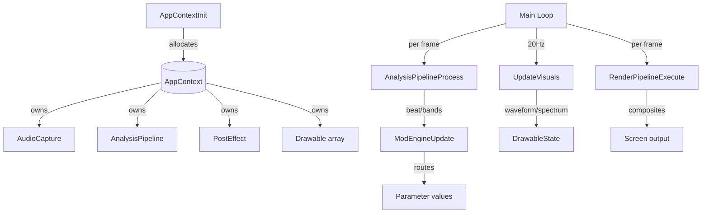

# Main Module
> Part of [AudioJones](../architecture.md)

## Purpose
Initializes all subsystems, runs the main loop, and orchestrates per-frame audio analysis, modulation updates, and rendering.

## Files
- **main.cpp**: Application entry point, subsystem lifecycle, render pipeline dispatch

## Data Flow

## Internal Architecture

### Application Context
`AppContext` aggregates all subsystem state: audio capture, analysis pipeline, post-effects, drawables, and modulation LFOs. `AppContextInit` allocates and initializes each subsystem using fail-fast macros (`INIT_OR_FAIL`, `CHECK_OR_FAIL`) that clean up on any failure. `AppContextUninit` releases resources in reverse order.

### Main Loop
Runs at 60 FPS with two update cadences:
- **Per-frame (60Hz)**: Audio capture polling, beat detection, modulation routing, rendering
- **Fixed interval (20Hz)**: Waveform and spectrum visual updates via `UpdateVisuals`

The loop toggles UI visibility with Tab key and resizes render targets on window resize.

### Render Pipeline Dispatch
`RenderPipelineExecute` delegates all rendering stages to the render module. The main loop passes drawable state, post-effect context, and audio spectrum data; the render module handles multi-pass compositing internally.

### Modulation Integration
Each frame updates four LFOs via `LFOProcess`, feeds results plus beat/band data into `ModSourcesUpdate`, then applies all modulation routes via `ModEngineUpdate`. This drives real-time parameter animation across effects and drawables.

### Thread Safety
Main loop executes entirely on the main thread. Audio capture callback runs on a separate audio thread; synchronization occurs within the audio module via atomic ring buffer pointers. No locking required in main.cpp.
