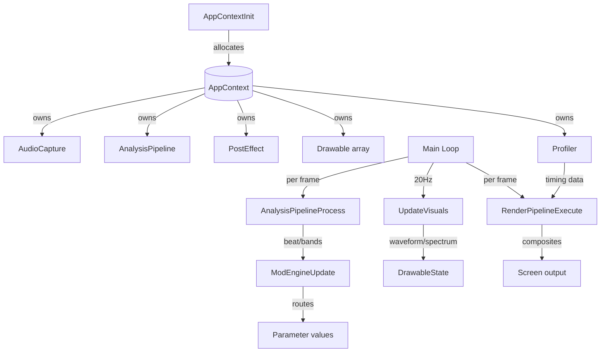

# Main Module
> Part of [AudioJones](../architecture.md)

## Purpose
Initializes all subsystems, runs the main loop, and orchestrates per-frame audio analysis, modulation updates, and rendering.

## Files
- **main.cpp**: Application entry point, subsystem lifecycle, render pipeline dispatch

## Data Flow

## Internal Architecture

### Application Context
`AppContext` aggregates all subsystem state: audio capture, analysis pipeline, post-effects, drawables, modulation LFOs (8 state/config pairs), and profiler. `AppContextInit` allocates and initializes each subsystem using fail-fast macros (`INIT_OR_FAIL`, `CHECK_OR_FAIL`) that clean up on any failure. After subsystem init, it registers parameters via `ParamRegistryInit` and explicitly registers LFO rate params (`lfo1.rate` through `lfo8.rate`) for modulation routing. `AppContextUninit` releases resources in reverse order.

### Initialization
Two-stage ImGui setup via `rlImGuiBeginInitImGui`/`rlImGuiEndInitImGui` enables custom font loading (Roboto-Medium.ttf at 15px) and docking configuration before finalizing the context. `ImGuiApplyNeonTheme` applies the UI color scheme.

### Main Loop
Runs at 60 FPS with two update cadences:
- **Per-frame (60Hz)**: Audio capture polling, beat detection, modulation routing, rotation accumulation via `DrawableTickRotations`, rendering
- **Fixed interval (20Hz)**: Waveform and spectrum visual updates via `UpdateVisuals`

The loop toggles UI visibility with Tab key (respecting `io.WantCaptureKeyboard`) and resizes render targets on window resize.

### Render Pipeline Dispatch
`RenderPipelineExecute` delegates all rendering stages to the render module. The main loop passes drawable state, post-effect context, audio spectrum data, and profiler; the render module records timing metrics and composes multi-pass output internally.

### Modulation Integration
Each frame updates 8 LFOs via `LFOProcess`, feeds results plus beat/band data into `ModSourcesUpdate`, then applies all modulation routes via `ModEngineUpdate`. This drives real-time parameter animation across effects and drawables.

### Thread Safety
Main loop executes entirely on the main thread. Audio capture callback runs on a separate audio thread; synchronization occurs within the audio module via atomic ring buffer pointers. No locking required in main.cpp.
