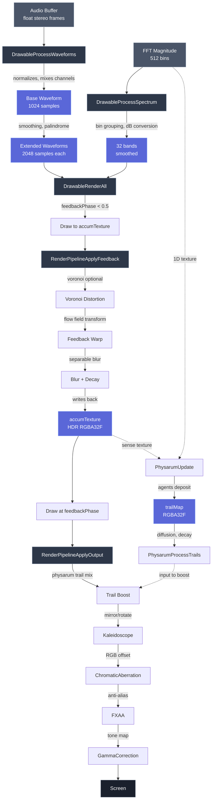

# Render Module
> Part of [AudioJones](../architecture.md)

## Purpose

Converts audio waveforms and spectrum data into visual primitives, applies shader-based effects, and orchestrates multi-pass rendering through feedback accumulation.

## Files

- **drawable.h/.cpp**: Unified drawable system that processes waveforms and spectrum, dispatches to renderers
- **waveform.h/.cpp**: Renders linear/circular oscilloscope with smoothing and cubic interpolation
- **spectrum_bars.h/.cpp**: Renders logarithmic band grouping with linear/circular layout
- **render_pipeline.h/.cpp**: Chains feedback and output shader passes
- **post_effect.h/.cpp**: Owns shader resources, render textures, and effect configuration
- **physarum.h/.cpp**: GPU particle simulation with agent-based trail renderer via compute shaders
- **draw_utils.h/.cpp**: Gradient sampling and opacity blending utilities
- **gradient.h/.cpp**: Linear interpolation between color stops
- **color_config.h**: Solid/rainbow/gradient color modes with HSV parameters
- **render_context.h**: Shared coordinate system for drawables
- **render_utils.h/.cpp**: HDR render target creation and fullscreen quad rendering

## Data Flow



**Legend:**
- Solid arrows: data transform
- Dotted arrows: texture binding
- Nodes represent functions or data buffers

## Internal Architecture

### Drawable System

The drawable system unifies waveforms and spectrum bars into a single processing pipeline. `DrawableState` maintains pre-computed rendering buffers (waveform palindromes, spectrum bands) and a global tick counter for synchronized animation.

The `DrawableRenderAll` function implements a two-pass rendering strategy: drawables with `feedbackPhase < 0.5` render before feedback processing, those with `feedbackPhase >= 0.5` render after. This allows fresh visuals to sit atop decaying trails. Opacity scales linearly with distance from 0.5 (`opacity = 1 - feedbackPhase` or `feedbackPhase` depending on pass).

### Waveform Processing

Waveforms follow a three-stage pipeline:
1. **Base processing** (`ProcessWaveformBase`): mixes stereo to mono based on channel mode, normalizes to peak amplitude
2. **Smoothing** (`ProcessWaveformSmooth`): applies multi-pass sliding window average, creates palindrome for circular display
3. **Rendering** (`DrawWaveformLinear/Circular`): draws line segments with per-vertex gradient sampling

Circular waveforms use cubic interpolation between samples to smooth the visual curve. Both modes apply `rotationOffset + rotationSpeed * globalTick` for synchronized rotation across multiple drawables.

### Spectrum Processing

`SpectrumBars` maps 512 FFT bins to 32 logarithmic bands (20 Hz to 20 kHz). Each band computes peak magnitude across its bin range, converts to dB, normalizes to `[minDb, maxDb]`, then applies exponential smoothing. Circular mode draws radial trapezoids, linear mode draws vertical rectangles.

### Render Pipeline

`RenderPipeline` chains shader passes using ping-pong textures to avoid read/write hazards. The feedback stage applies:
1. **Voronoi** (optional): edge-detected distortion keyed to FFT
2. **Feedback**: flow field warp (zoom/rotation/translation with radial gradients)
3. **Blur**: separable Gaussian with decay factor (`exp(-0.693 * dt / halfLife)`)

The output stage applies:
1. **Trail boost**: composites physarum trails with configurable blend modes
2. **Kaleidoscope**: radial mirror symmetry (2-16 segments)
3. **Chromatic aberration**: per-channel UV offset
4. **FXAA**: edge-adaptive anti-aliasing
5. **Gamma correction**: final tone mapping to LDR

All shaders receive resolution and effect parameters via uniform locations cached in `PostEffect`.

### Physarum Simulation

Physarum implements GPU-accelerated slime mold behavior using compute shaders (requires OpenGL 4.3+). Agents sense the `trailMap` and `accumTexture` (blended by `accumSenseBlend`), turn toward higher concentrations, then deposit colored trails based on their hue identity.

Trail processing runs in two passes: horizontal diffusion (no decay), then vertical diffusion with exponential decay. Agents receive FFT energy via a 1D texture to modulate deposit amount or behavior.

Agent hue assignment depends on color mode:
- **Solid**: distributes hues across spectrum to avoid clustering (unless color is saturated)
- **Gradient**: samples gradient at agent index
- **Rainbow**: distributes across `rainbowHue` to `rainbowHue + rainbowRange`

### Color System

`ColorConfig` supports three modes:
- **Solid**: single RGBA
- **Rainbow**: HSV sweep with configurable hue offset, range, saturation, value
- **Gradient**: linear interpolation between up to 8 position-keyed stops

`ColorFromConfig` evaluates color at position `t` (0-1 along waveform/spectrum) using triangular interpolation (`1 - |2t - 1|`) to create symmetric color distribution.

### HDR Accumulation

`PostEffect` uses `R32G32B32A32` float textures for `accumTexture` and ping-pong buffers. HDR prevents banding artifacts during feedback accumulation over hundreds of frames. Final gamma pass tone-maps to LDR for display.

## Usage Patterns

### Initialization

```cpp
DrawableState state;
DrawableStateInit(&state); // Allocates spectrum bars

PostEffect* pe = PostEffectInit(width, height); // Loads shaders, creates textures
```

### Per-Frame Rendering

```cpp
// 1. Process audio into drawable buffers
DrawableProcessWaveforms(&state, audioBuffer, framesRead, drawables, count, channelMode);
DrawableProcessSpectrum(&state, fftMagnitude, FFT_BIN_COUNT, drawables, count);

// 2. Draw pre-feedback pass to accumTexture
PostEffectBeginDrawStage(pe);
DrawableRenderAll(&state, &renderCtx, drawables, count, tick, true);
PostEffectEndDrawStage();

// 3. Apply feedback effects (writes back to accumTexture)
RenderPipelineApplyFeedback(pe, deltaTime, fftMagnitude);

// 4. Draw post-feedback pass to accumTexture
PostEffectBeginDrawStage(pe);
DrawableRenderAll(&state, &renderCtx, drawables, count, tick, false);
PostEffectEndDrawStage();

// 5. Apply output effects and render to screen
RenderPipelineApplyOutput(pe, tick);
```

### Thread Safety

Render module is single-threaded. Audio and FFT data must be copied to render thread before calling `DrawableProcess*` functions.

### Resource Management

All resources follow Init/Uninit lifecycle:
- `DrawableStateInit/Uninit`: manages spectrum bars
- `PostEffectInit/Uninit`: manages shaders, textures, physarum
- `PostEffectResize`: recreates render textures on window resize

Shader compilation failures are non-fatal; effect passes gracefully skip if shader ID is zero.
