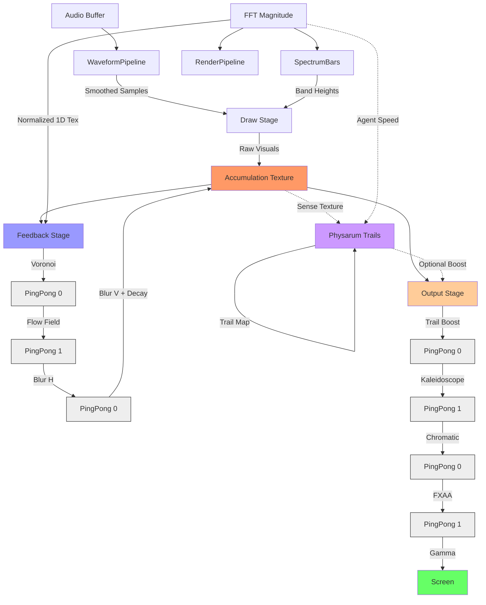

# Render Module
> Part of [AudioJones](../architecture.md)

## Purpose
Transforms audio waveforms and FFT data into GPU-rendered visuals through multi-stage post-processing pipeline with feedback accumulation.

## Files
- **render_pipeline.h/.cpp**: Orchestrates feedback and output post-processing stages across ping-pong buffers
- **post_effect.h/.cpp**: Allocates shaders, render textures, and accumulation buffer for temporal effects
- **physarum.h/.cpp**: Simulates particle-based slime mold agents using compute shaders for organic trail generation
- **render_utils.h/.cpp**: Provides HDR texture initialization and fullscreen quad rendering utilities
- **waveform_pipeline.h/.cpp**: Processes raw audio into smoothed waveforms and dispatches linear/circular draw calls
- **waveform.h/.cpp**: Renders audio oscilloscope with cubic interpolation, palindrome mirroring, and color animation
- **spectrum_bars.h/.cpp**: Converts FFT bins into logarithmic frequency bands and renders as radial or linear bars
- **gradient.h/.cpp**: Evaluates smooth color transitions between gradient stops for waveform/spectrum coloring
- **render_context.h**: Defines screen geometry shared across rendering components
- **color_config.h**: Declares color mode enums and gradient stop structures

## Data Flow

**Legend:**
- **Solid arrows**: Primary data flow
- **Dashed arrows**: Optional data flow
- **Buffer nodes**: Temporary render textures (ping-pong between two instances)

## Internal Architecture

The render module splits frame rendering into three isolated stages: draw, feedback, and output. This separation prevents visual recursion and enables temporal accumulation effects.

**Draw Stage** writes fresh waveforms and spectrum bars directly into the accumulation texture using raylib immediate-mode drawing. Waveforms apply per-config smoothing with sliding window averaging to reduce jitter while preserving peak amplitude. Circular waveforms mirror samples palindromically to create seamless loops, interpolated with cubic splines for visual continuity.

**Feedback Stage** implements temporal persistence by reading the accumulation texture through a chain of post-processing shaders. Voronoi distortion warps coordinates with animated cell patterns. The flow field shader applies an 8-parameter spatial transformation (base zoom/rotation, radial zoom/rotation, and 4 translation components) to create feedback motion. Two-pass Gaussian blur smooths the result horizontally then vertically while applying exponential decay based on configured half-life. This final blur writes back to the accumulation texture, closing the feedback loop.

**Output Stage** reads the accumulated frame and applies view-space effects without modifying persistence. Trail boost composites physarum agent trails using configurable blend modes. Kaleidoscope mirrors the image across radial segments. Chromatic aberration offsets RGB channels. FXAA antialiases jagged edges. Gamma correction tonemaps HDR values to screen. Each effect ping-pongs between two temporary buffers to avoid read-write hazards.

**Physarum Simulation** runs parallel to the main pipeline when enabled. Compute shaders dispatch 100K+ agents that sense trail intensity ahead and deposit color based on hue identity. Agents sample both the accumulation texture (for waveform-aware motion) and a normalized FFT texture (for bass-reactive speed). Trail processing applies separable diffusion and exponential decay in two compute passes. The trail map feeds back into agent sensing and optionally composites into the output stage.

**HDR Accumulation** uses R32G32B32A32 floating-point textures for the accumulation buffer to prevent precision loss during feedback. Twenty iterations of 5% decay would clamp to zero with 8-bit textures, but HDR preserves faint trails indefinitely. Gamma correction maps these unbounded values to displayable range only in the final output stage.

**Ping-Pong Buffering** alternates writes between two identical textures to avoid GPU pipeline stalls. Each shader reads from the last write target and outputs to the opposite buffer. This doubles memory but eliminates synchronization overhead.

## Usage Patterns

**Initialization** requires screen dimensions to allocate render textures. Call `PostEffectInit(width, height)` after raylib window creation but before any rendering. Returns NULL if compute shaders unavailable (OpenGL <4.3) or allocation fails. Physarum automatically initializes with the PostEffect and falls back gracefully if unsupported.

**Frame Rendering** splits into three explicit calls. Start with `PostEffectBeginDrawStage` to target the accumulation texture. Draw waveforms via `WaveformPipelineDraw` and spectrum via `SpectrumBarsDraw`. Call `PostEffectEndDrawStage` to release the texture. Execute `RenderPipelineApplyFeedback` with deltaTime and FFT magnitude to process temporal effects. Finally run `RenderPipelineApplyOutput` with the global tick counter to composite to screen.

**Resize Handling** calls `PostEffectResize(pe, newWidth, newHeight)` which recreates all render textures and notifies physarum. Existing accumulation clears to black since textures cannot resize in-place.

**Thread Safety** assumes single-threaded OpenGL context. All PostEffect and Physarum calls must originate from the rendering thread. Shader state modifications are not synchronized.

**Resource Cleanup** requires explicit `PostEffectUninit` to unload shaders, textures, and compute buffers. Physarum cleanup happens automatically within PostEffect destruction.
