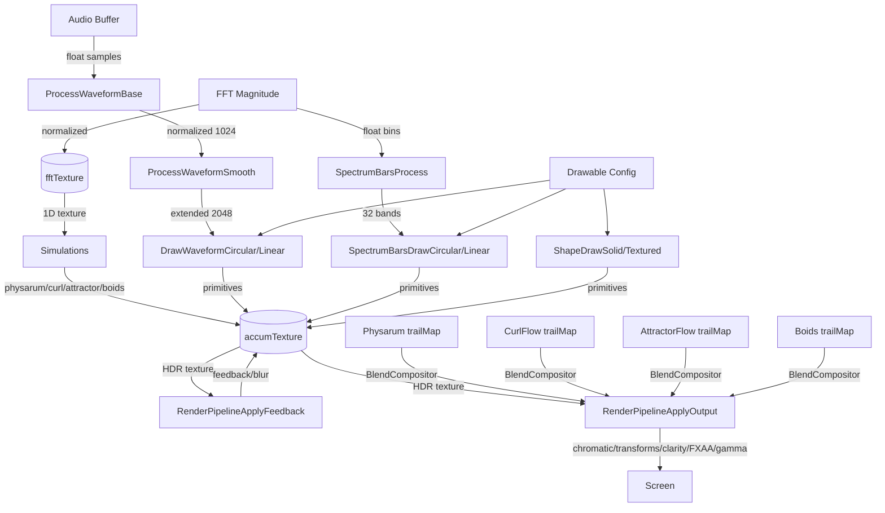

# Render Module
> Part of [AudioJones](../architecture.md)

## Purpose
Draws audio-reactive visuals (waveforms, spectrum bars, shapes) and applies multi-pass post-processing effects (feedback, blur, kaleidoscope, chromatic aberration) to an accumulation buffer.

## Files
- **blend_mode.h**: Defines EffectBlendMode enum with 16 Photoshop-style modes (boost, tinted_boost, screen, mix, soft_light, overlay, color_burn, linear_burn, vivid_light, linear_light, pin_light, difference, negation, subtract, reflect, phoenix) for simulation compositing
- **blend_compositor.h/.cpp**: Loads effect_blend.fs shader, binds effect textures with intensity and blend mode uniforms
- **color_config.h/.cpp**: Defines ColorConfig struct with solid/rainbow/gradient modes, GradientStop type, RGB-to-HSV conversion, equality comparison, agent hue extraction for simulation coloring, and saturation/value extraction for deposit coloring
- **color_lut.h/.cpp**: Generates 256-entry color lookup textures from ColorConfig for GPU sampling
- **draw_utils.h/.cpp**: Converts ColorConfig to raylib Color at position t with opacity
- **drawable.h/.cpp**: Orchestrates waveform/spectrum/shape rendering with per-drawable interval throttling
- **gradient.h/.cpp**: Evaluates gradient stops to interpolated Color at position t
- **post_effect.h/.cpp**: Loads 28 fragment shaders (feedback, blur_h, blur_v, chromatic, kaleidoscope, voronoi, fxaa, clarity, gamma, shape_texture, infinite_zoom, sine_warp, radial_streak, texture_warp, wave_ripple, mobius, pixelation, glitch, poincare_disk, toon, heightfield_relief, gradient_flow, droste_zoom, kifs, lattice_fold, color_grade, ascii_art, oil_paint, watercolor, neon_glow), allocates HDR render textures (accumTexture, ping-pong pair, outputTexture), creates Physarum/CurlFlow/AttractorFlow/Boids simulation instances, maintains fftTexture for normalized FFT magnitudes, exposes draw stage begin/end
- **profiler.h/.cpp**: Provides per-zone GPU timing via double-buffered GL_TIME_ELAPSED queries with 64-sample rolling history and EMA smoothing for stable UI display; zones are Feedback, Simulation, Drawables, Output
- **render_context.h**: Defines RenderContext struct (screen geometry, accumTexture reference, PostEffect pointer)
- **render_pipeline.h/.cpp**: Executes full render frame: simulation updates -> feedback/blur -> drawable rendering -> output chain; chains effects via ping-pong buffers with RenderPipelineExecute orchestrating profiler zones
- **shader_setup.h/.cpp**: Binds shader uniforms for each effect pass; provides GetTransformEffect dispatch table returning shader, setup callback, and enabled flag for 21 user-orderable transform effects; setup functions cover voronoi, feedback, blur, trail boost (physarum, curl flow, attractor flow, boids), kaleido, kifs, lattice_fold, sine_warp, infinite_zoom, radial_streak, texture_warp, wave_ripple, mobius, pixelation, glitch, poincare_disk, toon, heightfield_relief, gradient_flow, droste_zoom, color_grade, ascii_art, oil_paint, watercolor, neon_glow, chromatic, gamma, clarity
- **render_utils.h/.cpp**: Creates HDR framebuffers, draws fullscreen quads with Y-flip, clears render textures
- **shape.h/.cpp**: Draws solid or textured polygons with rotation animation
- **spectrum_bars.h/.cpp**: Maps FFT bins to 32 log-spaced bands; draws circular or linear bar visualizations
- **thick_line.h/.cpp**: Batches vertex-colored polylines into GPU quads with configurable thickness
- **waveform.h/.cpp**: Normalizes audio samples, applies smoothing, draws circular or linear waveforms via ThickLine

## Data Flow

## Internal Architecture

### Drawable System
DrawableState holds per-waveform extended buffers and a SpectrumBars instance. DrawableRenderFull iterates all Drawables, skips disabled or below-threshold opacity items, enforces per-drawable draw intervals, and dispatches to waveform/spectrum/shape renderers.

Validation enforces count <= MAX_DRAWABLES (16).

### Waveform Rendering
ProcessWaveformBase mixes stereo to mono via ChannelMode, normalizes to peak amplitude, fills WAVEFORM_SAMPLES (1024). ProcessWaveformSmooth creates a palindrome (2048 samples) and applies 3-pass sliding-window blur with peak restoration.

DrawWaveformCircular and DrawWaveformLinear emit vertices through ThickLine for GPU-batched quad rendering. Both apply per-vertex gradient coloring from ColorConfig and use rotation offset for color animation.

### Spectrum Visualization
SpectrumBarsInit precomputes 32 logarithmically-spaced bin ranges (20 Hz to 20 kHz). SpectrumBarsProcess finds peak magnitude per band, converts to dB, normalizes with minDb/maxDb, and applies exponential smoothing.

DrawCircular renders trapezoid quads centered on innerRadius. DrawLinear renders vertical rectangles with color offset animation.

### Shape Rendering
ShapeDrawSolid triangulates an N-sided polygon with per-triangle gradient coloring. ShapeDrawTextured samples accumTexture via shapeTextureShader with zoom/angle/brightness uniforms. Both apply rotation from globalTick.

### Post-Effect Pipeline
PostEffectInit allocates accumTexture plus two ping-pong buffers as HDR (RGBA32F) render textures. Loads 28 fragment shaders covering feedback, blur, transform effects, and output processing. Creates Physarum, CurlFlow, AttractorFlow, Boids, and BlendCompositor instances. Initializes fftTexture (1025x1 R32) for normalized FFT magnitudes.

RenderPipelineExecute orchestrates four profiler zones: Simulation (physarum/curl flow/attractor flow/boids updates), Feedback (feedback -> blur_h -> blur_v with decay), Drawables (waveform/spectrum/shape rendering), Output (trail boost passes -> chromatic -> user-ordered transform effects -> clarity/FXAA/gamma -> screen). Transform effects are dispatched via GetTransformEffect lookup table supporting 21 effect types.

Ping-pong pattern alternates source/destination each pass to avoid read-after-write hazards.

### Profiler
ProfilerInit allocates double-buffered GL_TIME_ELAPSED queries for four zones: Feedback, Simulation, Drawables, Output. ProfilerBeginZone/EndZone bracket GPU-timed sections. ProfilerFrameBegin reads previous frame's completed queries and applies EMA smoothing (5% factor) for stable UI display. ProfilerFrameEnd flips the double buffer and advances the 64-sample history ring buffer.

### Blend Compositor
BlendCompositorInit loads effect_blend.fs and caches uniform locations. BlendCompositorApply binds an effect texture (from Physarum, CurlFlow, AttractorFlow, or Boids trail maps) with intensity and EffectBlendMode uniforms. The shader applies one of 16 Photoshop-style blend formulas (boost, tinted boost, screen, mix, soft light, overlay, color burn, linear burn, vivid light, linear light, pin light, difference, negation, subtract, reflect, phoenix) during fullscreen quad rendering.

### Thread Safety
All rendering executes on the main thread. No cross-thread access to render state. Audio data arrives via copied buffers (waveform, fftMagnitude) passed by value each frame.
