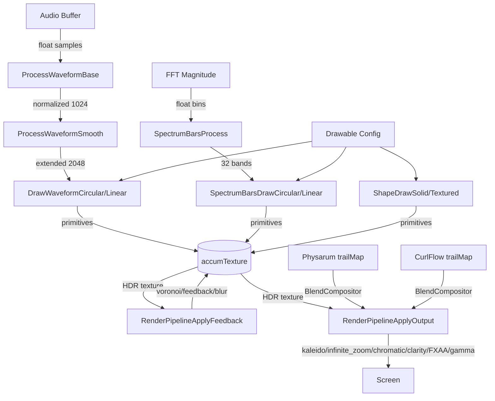

# Render Module
> Part of [AudioJones](../architecture.md)

## Purpose
Draws audio-reactive visuals (waveforms, spectrum bars, shapes) and applies multi-pass post-processing effects (feedback, blur, kaleidoscope, chromatic aberration) to an accumulation buffer.

## Files
- **blend_mode.h**: Defines EffectBlendMode enum (BOOST, TINTED_BOOST, SCREEN, MIX, SOFT_LIGHT) for simulation compositing
- **blend_compositor.h/.cpp**: Loads effect_blend.fs shader, binds effect textures with intensity and blend mode uniforms
- **color_config.h/.cpp**: Defines ColorConfig struct with solid/rainbow/gradient modes, GradientStop type, and RGB-to-HSV conversion
- **draw_utils.h/.cpp**: Converts ColorConfig to raylib Color at position t with opacity
- **drawable.h/.cpp**: Orchestrates waveform/spectrum/shape rendering with feedbackPhase-based opacity splitting
- **gradient.h/.cpp**: Evaluates gradient stops to interpolated Color at position t
- **post_effect.h/.cpp**: Loads 12 fragment shaders, allocates HDR render textures (accumTexture, ping-pong pair, outputTexture), exposes draw stage begin/end
- **render_context.h**: Defines RenderContext struct (screen geometry, accumTexture reference, PostEffect pointer)
- **render_pipeline.h/.cpp**: Chains feedback/blur/voronoi/kaleidoscope/infinite_zoom/chromatic/clarity/FXAA/gamma passes via ping-pong buffers
- **render_utils.h/.cpp**: Creates HDR framebuffers, draws fullscreen quads with Y-flip
- **shape.h/.cpp**: Draws solid or textured polygons with rotation animation
- **spectrum_bars.h/.cpp**: Maps FFT bins to 32 log-spaced bands; draws circular or linear bar visualizations
- **waveform.h/.cpp**: Normalizes audio samples, applies smoothing, draws circular or linear waveforms

## Data Flow

## Internal Architecture

### Drawable System
DrawableState holds per-waveform extended buffers and a SpectrumBars instance. DrawableRenderAll iterates all Drawables, computes opacity from feedbackPhase, and dispatches to waveform/spectrum/shape renderers. DrawableRenderFull bypasses phase-based opacity for physarum trail input.

Validation enforces limits: max 1 spectrum, 8 waveforms, 4 shapes per preset.

### Waveform Rendering
ProcessWaveformBase mixes stereo to mono via ChannelMode, normalizes to peak amplitude, fills WAVEFORM_SAMPLES (1024). ProcessWaveformSmooth creates a palindrome (2048 samples) and applies 3-pass sliding-window blur with peak restoration.

DrawWaveformCircular uses cubic interpolation between samples and applies per-segment gradient coloring from ColorConfig. DrawWaveformLinear scrolls color offset via rotation speed.

### Spectrum Visualization
SpectrumBarsInit precomputes 32 logarithmically-spaced bin ranges (20 Hz to 20 kHz). SpectrumBarsProcess finds peak magnitude per band, converts to dB, normalizes with minDb/maxDb, and applies exponential smoothing.

DrawCircular renders trapezoid quads centered on innerRadius. DrawLinear renders vertical rectangles with color offset animation.

### Shape Rendering
ShapeDrawSolid triangulates an N-sided polygon with per-triangle gradient coloring. ShapeDrawTextured samples accumTexture via shapeTextureShader with zoom/angle/brightness uniforms. Both apply rotation from globalTick.

### Post-Effect Pipeline
PostEffectInit allocates accumTexture plus two ping-pong buffers as HDR (RGBA32F) render textures. Loads 12 fragment shaders (feedback, blur_h, blur_v, chromatic, kaleidoscope, voronoi, physarum_boost, fxaa, clarity, gamma, shape_texture, infinite_zoom). Creates Physarum, CurlFlow, and BlendCompositor instances.

RenderPipelineApplyFeedback chains: curl flow update -> physarum update -> voronoi (optional) -> feedback -> blur_h -> blur_v (with decay). RenderPipelineApplyOutput chains: physarum trail boost (optional) -> curl flow trail boost (optional) -> kaleidoscope (optional) -> infinite_zoom (optional) -> blit to outputTexture -> chromatic -> clarity (optional) -> FXAA -> gamma -> screen.

Ping-pong pattern alternates source/destination each pass to avoid read-after-write hazards.

### Blend Compositor
BlendCompositorInit loads effect_blend.fs and caches uniform locations. BlendCompositorApply binds an effect texture (from Physarum or CurlFlow trail maps) with intensity and EffectBlendMode uniforms. The shader applies the selected blend formula (boost, tinted boost, screen, mix, or soft light) during fullscreen quad rendering.

### Thread Safety
All rendering executes on the main thread. No cross-thread access to render state. Audio data arrives via copied buffers (waveform, fftMagnitude) passed by value each frame.
