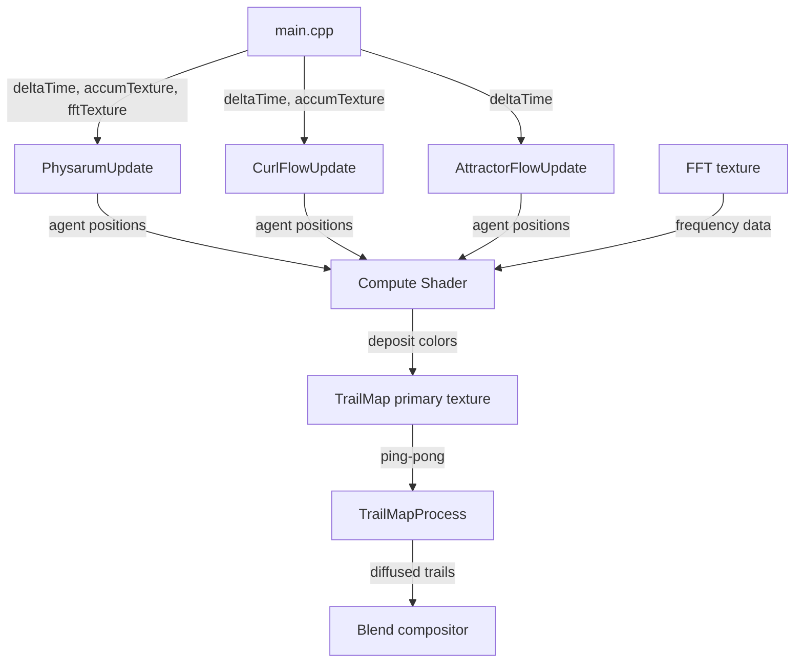

# simulation Module

GPU-accelerated agent simulations (Physarum, Curl Flow, and Attractor Flow) that deposit colored trails influenced by audio analysis.

## Files

- **attractor_flow.h/.cpp**: Strange attractor simulation integrating Lorenz, Rossler, Aizawa, and Thomas systems with 3D rotation and projection
- **curl_flow.h/.cpp**: Curl noise flow simulation with agents following procedural vector fields
- **physarum.h/.cpp**: Physarum polycephalum slime mold simulation with chemotaxis behavior
- **shader_utils.h/.cpp**: Shared shader loading with error logging
- **trail_map.h/.cpp**: Ping-pong render textures with GPU diffusion and decay processing

## Data Flow

**Entry Points:**
- `PhysarumInit` / `CurlFlowInit` / `AttractorFlowInit` - Allocate simulation resources
- `PhysarumUpdate` / `CurlFlowUpdate` / `AttractorFlowUpdate` - Dispatch agent compute shaders
- `PhysarumProcessTrails` / `CurlFlowProcessTrails` / `AttractorFlowProcessTrails` - Run diffusion/decay passes
- `PhysarumBeginTrailMapDraw` / `CurlFlowBeginTrailMapDraw` / `AttractorFlowBeginTrailMapDraw` - Inject external content into trail map

**Exit Points:**
- `TrailMapGetTexture` - Trail texture for compositing

## Internal Architecture

### Agent Buffer Management

All simulations store agent state in Shader Storage Buffer Objects (SSBOs). `PhysarumAgent` holds position, heading, hue identity, and spectrum position (32 bytes aligned). `CurlFlowAgent` holds position and velocity angle (32 bytes aligned). `AttractorAgent` holds 3D position (x/y/z), hue, and age (32 bytes aligned). Buffer reallocation occurs in `ApplyConfig` when agent count changes.

### Compute Shader Dispatch

Agent compute shaders run with work groups of 1024 threads. Each agent:
1. Samples trail density or accumulator texture based on `accumSenseBlend` (Physarum/Curl Flow only)
2. Adjusts heading (Physarum: chemotaxis sensors; Curl Flow: curl noise field; Attractor Flow: differential equations)
3. Moves by `stepSize` (2D sims) or integrates attractor dynamics with `timeScale` (Attractor Flow)
4. Deposits RGBA color at new position via `imageStore`

### Trail Map Processing

`TrailMapProcess` executes a separable two-pass Gaussian blur:
1. Horizontal pass: primary -> temp texture
2. Vertical pass with decay: temp -> primary texture

Decay factor derives from `decayHalfLife` using exponential decay: `exp(-0.693147 * deltaTime / halfLife)`.

### Color Distribution

Physarum assigns each agent a hue based on `ColorConfig`:
- Solid mode: extracts hue from RGB (distributes evenly if saturation < 0.1)
- Gradient mode: samples gradient at agent's normalized index
- Rainbow mode: spreads hue range across agent population

Curl Flow samples a `ColorLUT` texture generated from `ColorConfig`. Agents look up color by position in the flow field, allowing gradient and rainbow modes without per-agent hue storage.

Attractor Flow assigns random hue per agent at initialization, using per-frame saturation/value uniforms from `ColorConfig`.

### Curl Flow Gradient Pass

When `trailInfluence > 0.001`, Curl Flow dispatches a separate compute shader (`curl_gradient.glsl`) before the agent pass. This shader computes density gradients from the trail map and/or accumulator texture based on `accumSenseBlend`. Agents then bend their curl noise direction toward or away from high-density regions, creating self-organizing flow patterns (Bridson 2007 technique).

### Strange Attractor Integration

Attractor Flow integrates four attractor systems: Lorenz, Rossler, Aizawa, and Thomas. Each agent evolves through 3D phase space with configurable parameters (sigma/rho/beta for Lorenz, rosslerC for Rossler, thomasB for Thomas). Agents project from 3D to 2D via configurable screen position (x/y) and 3D rotation. Rotation uses `rotationAngleX/Y/Z` for static offsets and `rotationSpeedX/Y/Z` for animated rotation via CPU accumulation (`rotationAccumX/Y/Z`). `attractorScale` converts world units to screen pixels.

### Thread Safety

Simulations run on the main thread with GPU synchronization via `glMemoryBarrier`. No CPU-side threading. Compute writes complete before texture reads through `GL_SHADER_IMAGE_ACCESS_BARRIER_BIT | GL_TEXTURE_FETCH_BARRIER_BIT` barriers.
