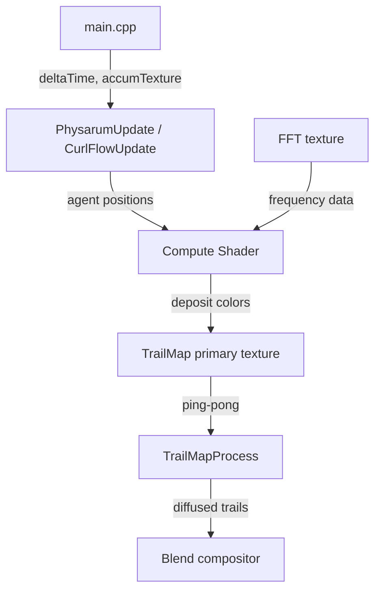

# simulation Module

GPU-accelerated agent simulations (Physarum and Curl Flow) that deposit colored trails influenced by audio analysis.

## Files

- **curl_flow.h/.cpp**: Curl noise flow simulation with agents following procedural vector fields
- **physarum.h/.cpp**: Physarum polycephalum slime mold simulation with chemotaxis behavior
- **shader_utils.h/.cpp**: Shared shader loading with error logging
- **trail_map.h/.cpp**: Ping-pong render textures with GPU diffusion and decay processing

## Data Flow

**Entry Points:**
- `PhysarumInit` / `CurlFlowInit` - Allocate simulation resources
- `PhysarumUpdate` / `CurlFlowUpdate` - Dispatch agent compute shaders
- `PhysarumProcessTrails` / `CurlFlowProcessTrails` - Run diffusion/decay passes

**Exit Points:**
- `TrailMapGetTexture` - Trail texture for compositing

## Internal Architecture

### Agent Buffer Management

Both simulations store agent state in Shader Storage Buffer Objects (SSBOs). `PhysarumAgent` holds position, heading, hue identity, and spectrum position (32 bytes aligned). `CurlFlowAgent` holds position and velocity angle (32 bytes aligned). Buffer reallocation occurs in `ApplyConfig` when agent count changes.

### Compute Shader Dispatch

Agent compute shaders run with work groups of 1024 threads. Each agent:
1. Samples trail density or accumulator texture based on `accumSenseBlend`
2. Adjusts heading (Physarum: chemotaxis sensors; Curl Flow: curl noise field)
3. Moves by `stepSize` in new direction
4. Deposits RGBA color at new position via `imageStore`

### Trail Map Processing

`TrailMapProcess` executes a separable two-pass Gaussian blur:
1. Horizontal pass: primary -> temp texture
2. Vertical pass with decay: temp -> primary texture

Decay factor derives from `decayHalfLife` using exponential decay: `exp(-0.693147 * deltaTime / halfLife)`.

### Color Distribution

Physarum assigns each agent a hue based on `ColorConfig`:
- Solid mode: extracts hue from RGB (distributes evenly if saturation < 0.1)
- Gradient mode: samples gradient at agent's normalized index
- Rainbow mode: spreads hue range across agent population

Curl Flow uses simpler per-frame saturation/value uniforms without per-agent hue storage.

### Thread Safety

Simulations run on the main thread with GPU synchronization via `glMemoryBarrier`. No CPU-side threading. Compute writes complete before texture reads through `GL_SHADER_IMAGE_ACCESS_BARRIER_BIT | GL_TEXTURE_FETCH_BARRIER_BIT` barriers.
