# UI Module
> Part of [AudioJones](../architecture.md)

## Purpose

Renders ImGui interface panels with modulation-aware controls and custom themed widgets. Translates user input into configuration mutations that drive visualization and effects.

## Files

- **theme.h**: Neon Eclipse color palette, shared dimensions, and inline helper functions
- **ui_units.h**: Unit conversion utilities for angle sliders
- **modulatable_slider.h/.cpp**: Slider with ghost handle, diamond indicator, and modulation routing popup
- **gradient_editor.h/.cpp**: Interactive gradient stop editor with add/delete/reorder/color-pick
- **imgui_panels.h/.cpp**: Theme application, dockspace setup, and shared drawing primitives
- **imgui_widgets.cpp**: Color mode selector with solid/rainbow/gradient support and hue range slider
- **imgui_effects.cpp**: Effects panel for blur, chroma, voronoi, physarum, flow field
- **imgui_drawables.cpp**: Drawable list panel for waveform/spectrum management
- **imgui_audio.cpp**: Audio input channel mode selector
- **imgui_analysis.cpp**: Beat graph and band meter visualizations
- **imgui_presets.cpp**: Preset save/load file browser
- **imgui_lfo.cpp**: LFO configuration panel for four oscillators

## Data Flow

```mermaid
graph LR
    subgraph Input
        Mouse[Mouse Position]
        Click[Mouse Click]
        Key[Keyboard]
    end

    subgraph Widgets
        Slider[ModulatableSlider]
        Gradient[GradientEditor]
        Section[DrawSectionBegin]
    end

    subgraph Panels
        Effects[ImGuiDrawEffectsPanel]
        Drawables[ImGuiDrawDrawablesPanel]
        Analysis[ImGuiDrawAnalysisPanel]
        Presets[ImGuiDrawPresetPanel]
        LFOs[ImGuiDrawLFOPanel]
    end

    subgraph Output
        Configs[AppConfigs structs]
        Routes[ModEngine routes]
        Files[Preset JSON files]
    end

    Mouse -->|hover/drag| Slider
    Click -->|activate| Gradient

    Slider -->|mutation| Configs
    Slider -->|route config| Routes
    Gradient -->|stop array| Configs
    Section -->|open state| Panels

    Effects -->|write| Configs
    Drawables -->|write| Configs
    LFOs -->|write| Configs
    Presets -->|save/load| Files

    Configs -.->|read for display| Analysis

    classDef input fill:#0A0810,stroke:#00E6F2
    classDef widget fill:#171421,stroke:#FF1493
    classDef panel fill:#1F1A29,stroke:#FF730D
    classDef output fill:#0F0D17,stroke:#00E6F2

    class Mouse,Click,Key input
    class Slider,Gradient,Section widget
    class Effects,Drawables,Analysis,Presets,LFOs panel
    class Configs,Routes,Files output
```



**Legend:**
- Solid arrows: direct data mutation
- Dotted arrows: read-only data flow
- Input: user interaction events
- Widgets: reusable controls
- Panels: top-level windows
- Output: persistent state changes

## Internal Architecture

### Theme System

`theme.h` defines the Neon Eclipse synthwave palette with cosmic blue-black backgrounds and electric cyan/magenta/orange accents. All colors exist in both `ImVec4` and `ImU32` formats for compatibility with ImGui's style system and direct draw list calls. `ImGuiApplyNeonTheme()` configures global ImGui style on startup.

Shared dimensions (`HANDLE_WIDTH`, `HANDLE_HEIGHT`, `HANDLE_RADIUS`) ensure visual consistency across custom widgets. Inline helpers `DrawInteractiveHandle()` and `SetColorAlpha()` factor out common glow effects.

### Custom Widgets

**ModulatableSlider** (`modulatable_slider.cpp`) wraps `ImGui::SliderFloat()` with modulation visualization. Queries `ModEngineGetRoute()` to check for active modulation. Draws a highlight bar between base and modulated values using `DrawModulationTrack()`. A diamond indicator button opens a popup with source selection buttons (bass/mid/treb/beat, LFO1-4), amount slider, and curve selector. Updates route via `ModEngineSetRoute()` and base value via `ModEngineSetBase()`.

**GradientEditor** (`gradient_editor.cpp`) renders a multi-color bar sampled at 128 points using `GradientEvaluate()`. Handles below the bar show stop positions with colors. Click on bar adds stops at interpolated colors. Drag to reposition (with neighbor constraints). Right-click deletes non-endpoint stops. Click without drag opens color picker popup. `SortStops()` maintains position order after mutations.

**HueRangeSlider** (`imgui_widgets.cpp:162`) draws a rainbow gradient bar with dual handles for selecting hue start/end angles. Used by rainbow color mode.

### Panel Organization

Panels use collapsible sections via `DrawSectionBegin()/DrawSectionEnd()` with static `bool` storage for open states. Sections cycle accent colors (cyan→magenta→orange) for visual hierarchy.

**ImGuiDrawEffectsPanel** (`imgui_effects.cpp`) provides core effect sliders and nested sections for voronoi, physarum, and flow field. Physarum section conditionally shows expanded controls when `enabled` is true.

**ImGuiDrawDrawablesPanel** (`imgui_drawables.cpp`) manages a unified drawable list with type indicators `[W]` for waveforms and `[S]` for spectrum. Add buttons enforce `MAX_DRAWABLES`, `MAX_WAVEFORMS`, and single-spectrum constraints. Delete button requires at least one waveform remain. Selected drawable shows type-specific controls in collapsible sections.

**ImGuiDrawAnalysisPanel** (`imgui_analysis.cpp`) displays read-only visualizations. `DrawBeatGraph()` renders beat intensity history as gradient bars with peak glow. `DrawBandMeter()` shows bass/mid/treb energy normalized by running average with tick marks at 50%/100%.

**ImGuiDrawPresetPanel** (`imgui_presets.cpp`) maintains persistent file list cache separate from `AppConfigs`. `RefreshPresetList()` calls `PresetListFiles()` to scan `presets/` directory. Selection change auto-loads via `PresetLoad()` and `PresetToAppConfigs()`. Save button writes via `PresetSave()` and `PresetFromAppConfigs()`.

**ImGuiDrawLFOPanel** (`imgui_lfo.cpp`) iterates four LFO configs with waveform dropdown (sine/triangle/sawtooth/square/sample-and-hold) and logarithmic rate slider.

### Drawing Primitives

`DrawGradientBox()` renders vertical gradient rectangles. `DrawGlow()` expands rectangles with alpha-blended borders. `DrawSectionHeader()` draws accent bar, collapse arrow, label, and invisible button for click detection. `SliderFloatWithTooltip()` wraps standard slider with hover text.

## Usage Patterns

### Initialization

1. Call `rlImGuiSetup()` to initialize raylib ImGui backend
2. Call `ImGuiApplyNeonTheme()` once to configure colors and spacing
3. Create `AppConfigs` struct with initial values
4. Call panel functions each frame within `rlImGuiBegin()/rlImGuiEnd()` block

### Per-Frame Update

```c
rlImGuiBegin();
ImGuiDrawDockspace();
ImGuiDrawEffectsPanel(&configs.effects, &modSources);
ImGuiDrawDrawablesPanel(configs.drawables, &configs.drawableCount, &selectedIdx);
ImGuiDrawAudioPanel(&configs.audio);
ImGuiDrawAnalysisPanel(&beat, &bands);
ImGuiDrawPresetPanel(&configs);
ImGuiDrawLFOPanel(configs.lfos);
rlImGuiEnd();
```

Panels mutate config structs directly. Caller detects changes by comparing against previous frame state or by tracking `ImGui::IsItemEdited()` on critical controls.

### Modulation Integration

Pass `ModSources*` to `ModulatableSlider()` for live value display. Register parameters via `ParamRegistryAdd()` before first use. Engine queries routes during render to compute final values.

### Custom Widget Integration

For new widgets, follow theme conventions: use `Theme::GLOW_*` for section headers cycling cyan/magenta/orange, `Theme::TEXT_PRIMARY_U32` for labels, `DrawInteractiveHandle()` for draggable elements.

### Thread Safety

All panel functions run on main thread during ImGui render pass. Config mutations are not thread-safe. Audio thread reads configs via lock-free copies or atomic flags.
