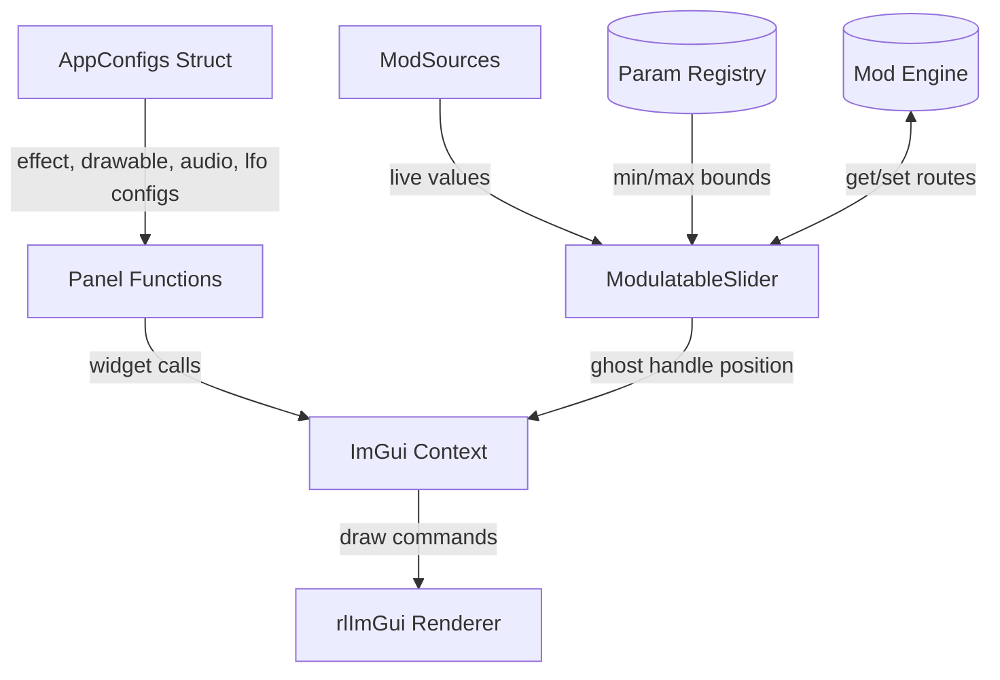

# UI Module
> Part of [AudioJones](../architecture.md)

## Purpose
Renders ImGui panels for configuring visualization parameters, audio settings, and presets. Provides custom widgets for gradient editing, modulation routing, and band energy meters.

## Files
- **imgui_panels.h**: Declares panel functions, DrawGradientBox, DrawGlow, DrawGroupHeader, DrawCategoryHeader, DrawSectionHeader, DrawSectionBegin/End, SliderFloatWithTooltip, TreeNodeAccented/Pop, IntensityToggleButton, ImGuiDrawColorMode, ImGuiDrawDrawablesSyncIdCounter
- **imgui_panels.cpp**: Applies Neon Eclipse theme colors, creates transparent dockspace
- **theme.h**: Defines synthwave color palette (cyan/magenta/orange accents, cosmic backgrounds), handle dimensions (HANDLE_WIDTH/HEIGHT/OVERLAP/RADIUS), DrawInteractiveHandle, SetColorAlpha, GetSectionGlow/GetSectionAccent for cycling accent colors
- **ui_units.h**: Angle conversion helpers (SliderAngleDeg, ModulatableSliderAngleDeg, ModulatableSliderInt) for degree-display sliders storing radians; SliderDrawInterval for frame-skip timing
- **modulatable_slider.h/.cpp**: Drop-in slider with ghost handle for modulated values, popup for route config
- **modulatable_drawable_slider.h/.cpp**: Wrapper building paramId from drawable ID and field name; includes angle variant ModulatableDrawableSliderAngleDeg
- **drawable_type_controls.h/.cpp**: Type-specific control sections for waveform, spectrum, and shape drawables
- **gradient_editor.h/.cpp**: Interactive multi-stop gradient bar with draggable handles and color picker
- **imgui_widgets.cpp**: Gradient box, glow effect, group/category/section headers, tooltip slider, hue range slider, color mode selector, tree node accented helpers, intensity toggle button
- **imgui_effects.cpp**: Effects panel organized by FEEDBACK (blur, half-life, flow field), OUTPUT (chroma, gamma, clarity), SIMULATIONS (Physarum, Curl Flow, Attractor Flow, Boids), and TRANSFORMS groups; transform pipeline reordering via drag-and-drop
- **imgui_effects_transforms.h/.cpp**: Transform category UI sections: DrawSymmetryCategory (Kaleidoscope, KIFS, Poincare Disk), DrawWarpCategory (Sine Warp, Texture Warp, Gradient Flow, Wave Ripple, Mobius), DrawCellularCategory (Voronoi, Lattice Fold), DrawMotionCategory (Infinite Zoom, Radial Blur, Droste Zoom), DrawStyleCategory (Pixelation, Glitch, Toon, Oil Paint, Watercolor, Neon Glow, Heightfield Relief, Color Grade, ASCII Art)
- **imgui_drawables.cpp**: Drawable list management (add/delete/reorder), per-drawable settings; ImGuiDrawDrawablesSyncIdCounter restores ID counter after preset load
- **imgui_audio.cpp**: Audio panel with channel mode selector
- **imgui_analysis.cpp**: Beat detection graph, band energy meters with gradient bars and glow, profiler flame graph, frame budget bar, per-zone timing sparklines
- **imgui_presets.cpp**: Preset save/load panel with file browser and auto-load on selection
- **imgui_lfo.cpp**: LFO panel with rate, waveform, and enable controls for 4 oscillators

## Data Flow

## Internal Architecture

### Theme System
`theme.h` defines a namespace of constexpr colors organized by function: background layers (VOID through SURFACE), primary/secondary/tertiary accents (cyan, magenta, orange with dim/hover variants), text hierarchy, and glow effects as ImU32. `ThemeColor` namespace provides raylib Color versions for waveform rendering. `DrawInteractiveHandle` renders slider handles with glow on hover/active states. `GetSectionGlow` and `GetSectionAccent` cycle through accent colors for consistent visual grouping across collapsible sections.

### Modulatable Sliders
`ModulatableSlider` wraps ImGui::SliderFloat with three additions: (1) queries ParamRegistry for min/max bounds using paramId, (2) draws a modulation track showing base value, limit, and current modulated position using the source's color, (3) renders a diamond indicator that pulses when routed, opening a popup for source selection and amount adjustment. `ModulatableDrawableSlider` constructs paramId from drawable ID and field name to reduce boilerplate.

### Custom Widgets
`GradientEditor` draws a sampled gradient bar with draggable stop handles. Left-click adds stops; right-click deletes. Click without drag opens a color picker popup. Handles lock at endpoints (0.0, 1.0). `HueRangeSlider` (internal to `imgui_widgets.cpp`) renders a rainbow bar with dual handles for selecting hue start/end. Both widgets use `DrawInteractiveHandle` for consistent visual treatment. `IntensityToggleButton` toggles a float parameter between 0.0 and 1.0, updating the modulation engine base value. `TreeNodeAccented`/`TreeNodeAccentedPop` wrap ImGui tree nodes with a vertical accent bar spanning the expanded content.

### Panel Functions
Each `ImGuiDraw*Panel` function opens an ImGui window, draws a header with theme accent color, then renders controls. `imgui_effects.cpp` organizes effects into FEEDBACK, OUTPUT, SIMULATIONS, and TRANSFORMS groups using `DrawGroupHeader`. Transform effects use `DrawCategoryHeader` for subcategories (Symmetry, Warp, Cellular, Motion, Style) and `DrawSectionBegin`/`DrawSectionEnd` for collapsible effect controls within each category. `imgui_effects_transforms.cpp` contains the category draw functions extracted from `imgui_effects.cpp`. `imgui_drawables.cpp` maintains a static `sNextDrawableId` counter for stable IDs across add/delete operations and calls `DrawableParamsRegister`/`DrawableParamsUnregister`/`DrawableParamsSyncAll` to synchronize with the parameter registry. `imgui_analysis.cpp` draws beat history as gradient bars with peak glow, band meters with self-calibrating normalization, and profiler visualizations including a stacked flame graph, frame budget percentage bar, and per-zone sparkline history.

### Thread Safety
All panel functions run on the main thread during the ImGui frame. No locks required. ModEngine queries and ParamRegistry lookups occur synchronously within panel calls.
