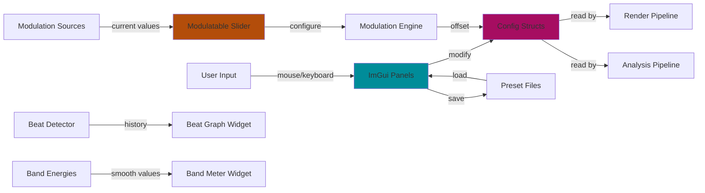

# UI Module
> Part of [AudioJones](../architecture.md)

## Purpose
Exposes configuration controls for all system parameters via dockable ImGui panels with custom synthwave theme and specialized widgets.

## Files
- **imgui_panels.h** - Panel entry points and shared widget declarations
- **imgui_panels.cpp** - Dockspace creation and Neon Eclipse theme initialization
- **theme.h** - Synthwave color palette constants and interactive handle rendering utilities
- **imgui_effects.cpp** - Effects panel with post-processing controls (blur, chromatic aberration, kaleidoscope, voronoi, physarum, flow field)
- **imgui_waveforms.cpp** - Waveform list management panel with geometry, animation, and color sections
- **imgui_spectrum.cpp** - Spectrum bars configuration panel with geometry, dynamics, animation, and color sections
- **imgui_presets.cpp** - Preset save/load panel with file browser and auto-load on selection
- **imgui_analysis.cpp** - Beat graph and band energy meters with custom gradient bars and glow effects
- **imgui_lfo.cpp** - LFO configuration panel with waveform selection and rate controls
- **imgui_audio.cpp** - Audio input channel mode selection panel
- **imgui_widgets.cpp** - Shared widget implementations (section headers, gradient box, color mode editor, hue range slider)
- **modulatable_slider.h** - Slider interface declaration with modulation route configuration
- **modulatable_slider.cpp** - Slider with modulation indicator, source selection popup, and ghost handle showing modulated value
- **gradient_editor.h** - Gradient widget interface declaration
- **gradient_editor.cpp** - Interactive gradient stop editor with drag, add, delete, and color picker
- **ui_units.h** - Unit conversion utilities for angle sliders (radians to degrees)

## Data Flow

**Legend:**
- Solid arrows: data read/write operations
- Dashed connections would indicate optional flows (none in this module)

## Internal Architecture

The module separates theme definition, widget primitives, and panel composition into distinct layers.

**Theme Layer:** Constants in `theme.h` define the Neon Eclipse palette (deep cosmic backgrounds with cyan/magenta/orange accents). ImU32 versions enable direct draw list operations. The `DrawInteractiveHandle` utility renders handles with hover/active glow effects consistently across widgets.

**Widget Primitives:** Reusable components like `DrawSectionHeader` create collapsible sections with accent bars. The `GradientEditor` widget controls stop manipulation with position constraints and color picker popups. `ModulatableSlider` wraps standard sliders with modulation indicators and source selection popups.

**Panel Layer:** Each panel queries its config struct via function parameters. Panels maintain persistent section open/closed states as static variables. The `ImGuiDrawDockspace` function creates a transparent passthrough central node so visualization renders behind panels.

**Design Decision:** Panels receive live `ModSources*` pointers to display real-time modulation values under source buttons. This creates a read-only dependency on automation state but avoids polling overhead.

**Trade-off:** Static variables for section states prevent multi-instance panels but simplify persistence. Single-instance constraint matches the application's single-window design.

**Custom Widgets:** The hue range slider draws a rainbow gradient bar with dual handles constrained to prevent crossover. The gradient editor uses invisible buttons over the bar region to detect clicks for adding stops versus dragging existing handles.

## Usage Patterns

**Initialization:** Call `ImGuiApplyNeonTheme()` once after `rlImGuiSetup()`. Call `ImGuiDrawDockspace()` every frame before panel draws.

**Panel Integration:** Each panel function accepts pointers to its config structs. Panels modify configs directly via ImGui's data binding. Caller detects changes by comparing config snapshots or tracking dirty flags externally.

**Modulatable Parameters:** Parameters must be registered in `param_registry` with min/max bounds before using `ModulatableSlider`. The slider queries `ModEngineGetRoute` and `ModEngineGetOffset` to display current modulation state.

**Thread Safety:** All panel functions assume single-threaded UI context. ImGui state and config struct modifications occur on the main thread only.

**Preset Flow:** `ImGuiDrawPresetPanel` maintains file list cache and auto-loads presets when selection changes. It calls `PresetToAppConfigs` which overwrites all config structs pointed to by `AppConfigs*`.
