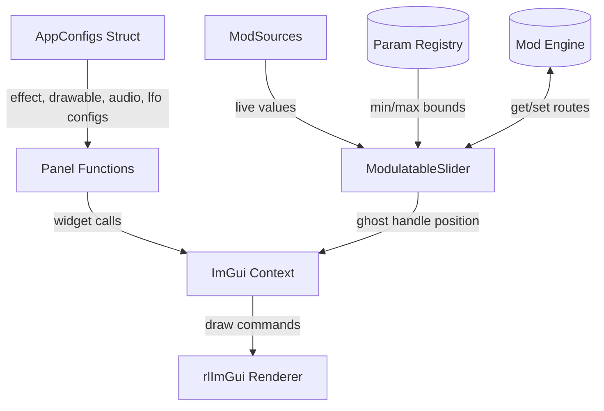

# UI Module
> Part of [AudioJones](../architecture.md)

## Purpose
Renders ImGui panels for configuring visualization parameters, audio settings, and presets. Provides custom widgets for gradient editing, modulation routing, and band energy meters.

## Files
- **imgui_panels.h**: Declares panel functions and reusable widget helpers
- **imgui_panels.cpp**: Applies Neon Eclipse theme colors, creates transparent dockspace
- **theme.h**: Defines synthwave color palette (cyan/magenta/orange accents, cosmic backgrounds)
- **ui_units.h**: Angle conversion helpers for degree-display sliders storing radians
- **modulatable_slider.h/.cpp**: Drop-in slider with ghost handle for modulated values, popup for route config
- **modulatable_drawable_slider.h/.cpp**: Wrapper building paramId from drawable ID and field name
- **drawable_type_controls.h/.cpp**: Type-specific control sections for waveform, spectrum, and shape drawables
- **gradient_editor.h/.cpp**: Interactive multi-stop gradient bar with draggable handles and color picker
- **imgui_widgets.cpp**: Section headers, hue range slider, color mode selector (solid/rainbow/gradient)
- **imgui_effects.cpp**: Effects panel with collapsible sections for Voronoi, Physarum, and Flow Field
- **imgui_drawables.cpp**: Drawable list management (add/delete/reorder), per-drawable settings
- **imgui_audio.cpp**: Audio panel with channel mode selector
- **imgui_analysis.cpp**: Beat detection graph, band energy meters with gradient bars and glow
- **imgui_presets.cpp**: Preset save/load panel with file browser and auto-load on selection
- **imgui_lfo.cpp**: LFO panel with rate, waveform, and enable controls for 4 oscillators

## Data Flow

## Internal Architecture

### Theme System
`theme.h` defines a namespace of constexpr colors organized by function: background layers (VOID through SURFACE), primary/secondary/tertiary accents (cyan, magenta, orange with dim/hover variants), text hierarchy, and glow effects as ImU32. `ThemeColor` namespace provides raylib Color versions for waveform rendering. `DrawInteractiveHandle` renders slider handles with glow on hover/active states.

### Modulatable Sliders
`ModulatableSlider` wraps ImGui::SliderFloat with three additions: (1) queries ParamRegistry for min/max bounds using paramId, (2) draws a modulation track showing base value, limit, and current modulated position using the source's color, (3) renders a diamond indicator that pulses when routed, opening a popup for source selection and amount adjustment. `ModulatableDrawableSlider` constructs paramId from drawable ID and field name to reduce boilerplate.

### Custom Widgets
`GradientEditor` draws a sampled gradient bar with draggable stop handles. Left-click adds stops; right-click deletes. Click without drag opens a color picker popup. Handles lock at endpoints (0.0, 1.0). `HueRangeSlider` (internal to `imgui_widgets.cpp`) renders a rainbow bar with dual handles for selecting hue start/end. Both widgets use `DrawInteractiveHandle` for consistent visual treatment.

### Panel Functions
Each `ImGuiDraw*Panel` function opens an ImGui window, draws a header with theme accent color, then renders controls. `imgui_effects.cpp` uses `DrawSectionBegin`/`DrawSectionEnd` for collapsible groups. `imgui_drawables.cpp` maintains a static `sNextDrawableId` counter for stable IDs across add/delete operations and calls `DrawableParamsRegister` to populate the parameter registry. `imgui_analysis.cpp` draws beat history as gradient bars with peak glow and band meters with self-calibrating normalization.

### Thread Safety
All panel functions run on the main thread during the ImGui frame. No locks required. ModEngine queries and ParamRegistry lookups occur synchronously within panel calls.
