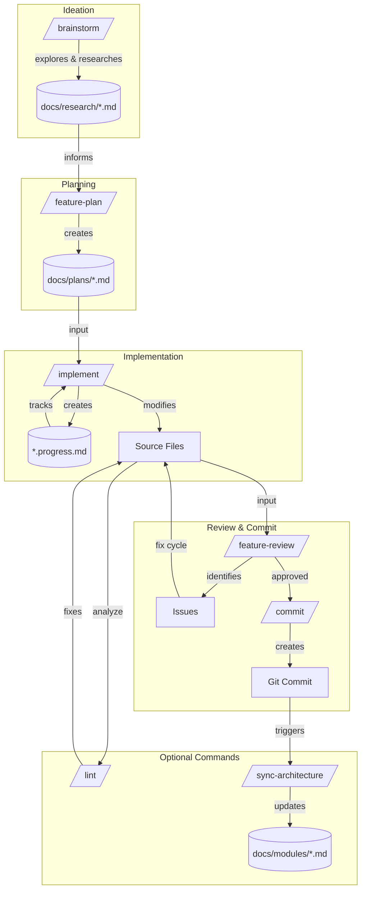

# Claude Code Workflow

Slash commands guide feature development from planning through implementation and review.

## Command Flow

## Core Commands

### /feature-plan

Explores codebase, asks clarifying questions, designs architecture, writes plan. When research docs exist, a fresh agent compares the plan against research sources to catch drift, hallucinated techniques, or omitted steps.

**When to use**: Starting a new feature or significant change.

**Output**: `docs/plans/<feature-name>.md` with phased implementation steps, dependency metadata, and file lists per phase.

### /implement

Implements a plan phase-by-phase with progress tracking and automatic commits. When phases declare `**Depends on**:` and `**Files**:` metadata, detects parallelizable waves and dispatches concurrent agents for independent phases.

**When to use**: After `/feature-plan` produces a plan document.

**Usage**: `/implement docs/plans/feature-name.md [phase-number]`

**Output**: Code changes, `*.progress.md` companion file, git commits per phase. Parallel mode executes one wave per invocation.

### /feature-review

Reviews implementation against its plan using parallel code-reviewer agents.

**When to use**: After completing `/implement` phases.

**Usage**: `/feature-review docs/plans/feature-name.md`

**Output**: Issue list with severity, file locations, and suggested fixes.

### /commit

Creates a git commit following project conventions.

**When to use**: After completing work that should be committed.

**Output**: Git commit with imperative-mood subject line.

## Optional Commands

### /brainstorm

Explores a vague idea through collaborative dialogue, then researches the technique with real references. Combines ideation and research in one flow.

**When to use**: Before `/feature-plan` when starting from a vague idea or when adding something that needs sourced algorithms.

**Usage**: `/brainstorm [optional starting idea]`

**Output**: `docs/research/<name>.md` with algorithm, references, and parameters.

### /lint

Runs clang-tidy static analysis and lizard complexity metrics. Triages findings, filters expected UI verbosity, presents options before fixing.

**When to use**: Before review, when code quality check needed, or to find complexity hotspots.

**Output**: Grouped findings by severity, actionable fixes with user consent.

### /sync-architecture

Regenerates architecture documentation from current code state.

**When to use**: After significant code changes to keep docs current.

**Output**: Updated `docs/architecture.md` and `docs/modules/*.md`.

## Typical Workflow

1. **Ideate** (optional): `/brainstorm` — explore idea, research technique, create research doc
2. **Plan**: `/feature-plan <description>` — explore, clarify, design
3. **Implement**: `/implement docs/plans/name.md` — build phase by phase
4. **Review**: `/feature-review docs/plans/name.md` — check against plan
5. **Commit**: `/commit` — finalize changes
6. **Sync**: `/sync-architecture` — update documentation
