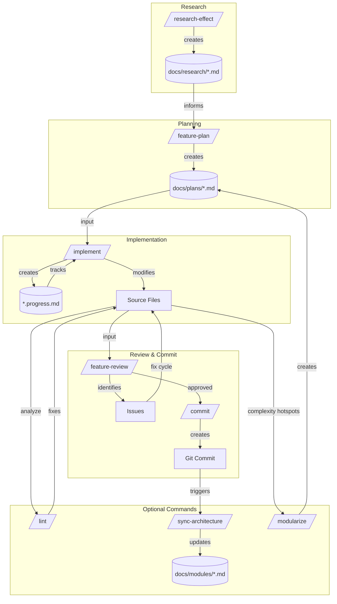

# Claude Code Workflow

Slash commands guide feature development from planning through implementation and review.

## Command Flow

## Core Commands

### /feature-plan

Explores codebase, asks clarifying questions, designs architecture, writes plan.

**When to use**: Starting a new feature or significant change.

**Output**: `docs/plans/<feature-name>.md` with phased implementation steps.

### /implement

Implements a plan one phase at a time with progress tracking and automatic commits.

**When to use**: After `/feature-plan` produces a plan document.

**Usage**: `/implement docs/plans/feature-name.md [phase-number]`

**Output**: Code changes, `*.progress.md` companion file, git commits per phase.

### /feature-review

Reviews implementation against its plan using parallel code-reviewer agents.

**When to use**: After completing `/implement` phases.

**Usage**: `/feature-review docs/plans/feature-name.md`

**Output**: Issue list with severity, file locations, and suggested fixes.

### /commit

Creates a git commit following project conventions.

**When to use**: After completing work that should be committed.

**Output**: Git commit with imperative-mood subject line.

## Optional Commands

### /research-effect

Researches a new visual effect before planning. Finds real references, classifies pipeline compatibility, and gates on confirmed sources.

**When to use**: Before `/feature-plan` when adding a new visual effect.

**Usage**: `/research-effect <effect-description>`

**Output**: `docs/research/<effect-name>.md` with algorithm, references, and parameters.

### /lint

Runs clang-tidy static analysis and triages warnings.

**When to use**: Before review or when code quality check needed.

**Output**: Inline fixes for straightforward issues, plan for complex ones.

### /sync-architecture

Regenerates architecture documentation from current code state.

**When to use**: After significant code changes to keep docs current.

**Output**: Updated `docs/architecture.md` and `docs/modules/*.md`.

### /modularize

Analyzes files for module extraction candidates using complexity metrics.

**When to use**: When files exceed complexity thresholds (CCN >15, NLOC >75).

**Output**: Extraction plan in `docs/plans/modularize-<target>.md`.

## Typical Workflow

1. **Research** (effects only): `/research-effect <description>` — find references, classify
2. **Plan**: `/feature-plan <description>` — explore, clarify, design
3. **Implement**: `/implement docs/plans/name.md` — build phase by phase
4. **Review**: `/feature-review docs/plans/name.md` — check against plan
5. **Commit**: `/commit` — finalize changes
6. **Sync**: `/sync-architecture` — update documentation
